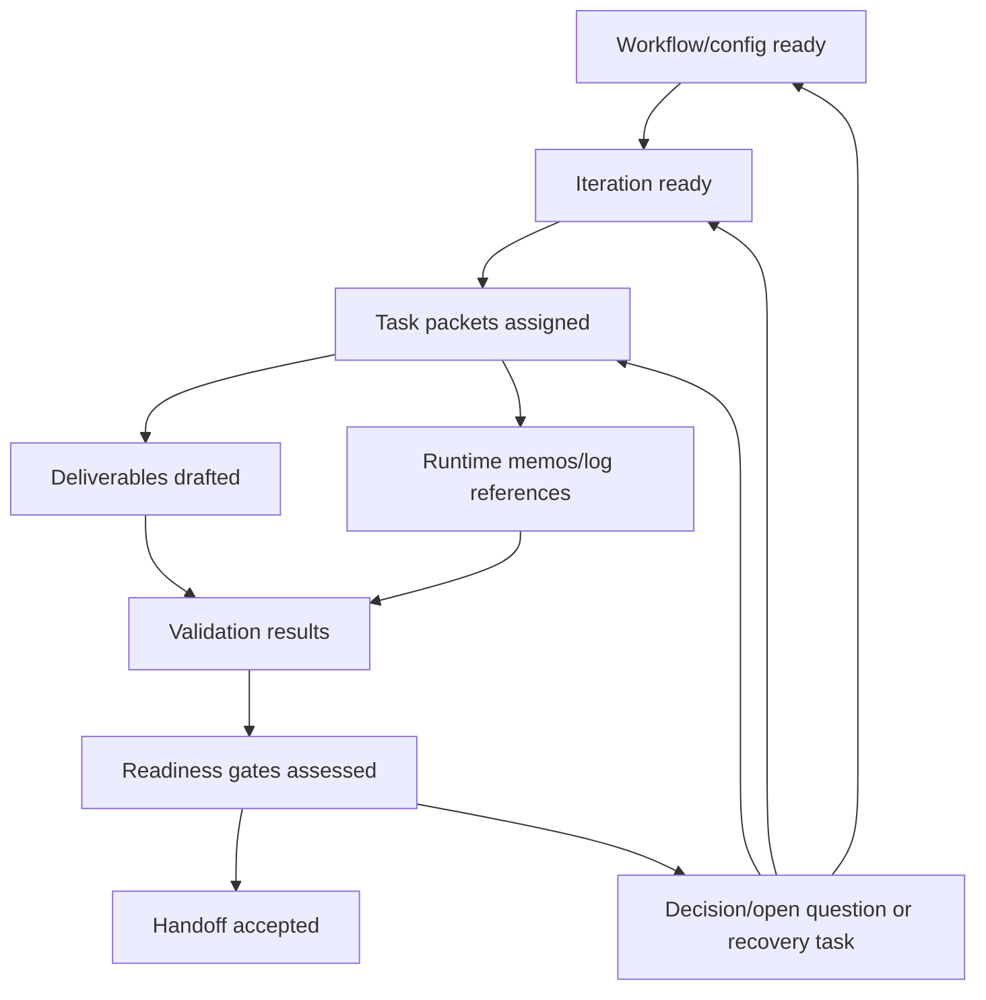

# MVP1 Platform Business Entities

- **Status**: draft MVP1 entity model
- **Owning workflow**: `synapse-concept-to-implementation`
- **Iteration**: `mvp1-iteration-02-entities-models`
- **Domain**: orchestration-framework / CLI-assisted concept-to-implementation
- **Last updated**: 2026-05-03

## Purpose

This document defines the conceptual business entities for MVP1. MVP1 is a
repository-first, CLI-assisted orchestration workflow over the existing
orchestration framework. These entities describe the operating contracts for
workflow configuration, bounded role-agent work, deliverables, memos,
validation, decisions, readiness gates, and runtime references without
committing to future product runtime infrastructure.

## Source register

| Source | Entity-model use |
| --- | --- |
| `docs/refinement/iteration-inputs/mvp1-iteration-02-entities-models.md` | Iteration goal and completion criteria for ownership, lifecycle, validation, and data relationships. |
| `docs/MVP1/Platform/Overview.md` | MVP1 boundary, in-scope platform concepts, deferred runtime concerns, and downstream readiness criteria. |
| `docs/MVP1/Platform/Infrastructure.md` | Repository-first infrastructure components, task-packet fields, validation scope, state posture, and deferred infrastructure. |
| `docs/requirements/FUNCTIONAL_REQUIREMENTS.md` | Functional requirements for canonical docs, workflows, task packets, validation, completion signals, personas, readiness gates, dependencies, and immutable sources. |
| `docs/architecture/TECHNICAL_SPECIFICATIONS.md` | Technology-neutral conceptual contracts, future runtime states, event families, observability needs, and open implementation choices. |
| `docs/architecture/DECISIONS.md` | ADR-0011 through ADR-0014: CLI-assisted MVP1, orchestration-framework domain, Markdown-first metadata, and initial validator scope. |
| `docs/work_items/INDEX.md` | MVP1 epic/story IDs, readiness labels, dependency sequence, and story readiness gates. |
| `docs/work_items/TECHNICAL_REFINEMENT_GATES.md` | Required metadata, technical readiness gates, validation expectations, and agent-output criteria. |

## Entity modeling principles

1. **Conceptual, not physical**: entities are logical contracts expressed in
   Markdown-first artifacts, task packets, memos, and validation records.
2. **Canonical docs are the durable contract**: committed `docs/` and
   `.orchestration/config/` files define reviewable truth. Runtime memos and
   logs are references, not durable product records.
3. **Configuration before runtime**: MVP1 defines workflow/task metadata and
   validation expectations; it does not implement a persisted workflow runtime,
   event bus, schema registry, telemetry store, or approval service.
4. **Bounded ownership**: every editable deliverable, task packet, and readiness
   gate needs an accountable owner or reviewer to prevent unsafe parallel work.
5. **Explicit uncertainty**: assumptions, open questions, blockers, validation
   needs, and out-of-scope future concerns must be recorded rather than implied.
6. **Immutable source handling**: MVP1 tasks must not edit `raw/` or
   `research/`; canonical docs may cite promoted claims from those inputs.

## Entity catalog

| Entity | MVP1 responsibility | Primary owner | Canonical location or reference |
| --- | --- | --- | --- |
| Workflow/config | Defines CLI-assisted workflow phases, iterations, roles, dependencies, source references, deliverables, and launch/completion criteria. | Artifact orchestrator / integrator with tech lead review | `.orchestration/config/`, workflow input packets, platform docs |
| Iteration | Bounded execution slice within a workflow phase, including goal, sources, role work, deliverables, and completion criteria. | Iteration owner or orchestrator | `docs/refinement/iteration-inputs/`, generated task cards, handoff summaries |
| Role/persona reference | Role-scoped guidance used to assign perspective, boundaries, tools, quality bar, evidence rules, and completion protocol. | Persona or standards owner; task owner for role binding | `.orchestration/config/agent-personas.yaml`, task packets, standards |
| Task packet | Executable role-agent work contract with sources, prohibited edits, target deliverables, dependencies, validation, and handoff audience. | Task owner / orchestrator | Generated task cards or iteration input packets |
| Deliverable/artifact | Reviewable output created or updated by a task, usually a canonical Markdown document. | Named role owner; integrator for shared artifacts | `docs/`, `.orchestration/config/` when configuration is the deliverable |
| Memo/handoff | Runtime coordination note for ready-to-consume work, blockers, partial completion, or merge context. | Producing role agent | `.orchestration/runtime/agent-sync/` |
| Validation result | Deterministic or review-only evidence about whether expected artifacts, sections, IDs, source immutability, and completion signals pass. | Validator owner, QA/standards reviewer, or integrator | Handoff summaries, readiness records, future E03 validator outputs |
| Decision/open question | Accepted decision, assumption, blocker, validation need, or unresolved question affecting scope, sequencing, or implementation readiness. | Product, architecture, tech lead, or sponsor depending on topic | `docs/architecture/DECISIONS.md`, requirements, work-item docs, deliverables |
| Readiness gate | Product, requirements, architecture, quality, dependency, risk, implementation, or agent-output gate used to decide whether work can start or hand off. | Gate-specific reviewer; integrator for final readiness | `docs/work_items/INDEX.md`, `docs/work_items/TECHNICAL_REFINEMENT_GATES.md` |
| Runtime/log reference | Pointer to generated task cards, agent memos, CLI logs, branches, SHAs, or validation command output used for traceability during a run. | Producing agent or orchestrator | `.orchestration/runtime/`, git metadata, handoff summaries |

## Entity definitions

### Workflow/config

**Definition**: The configuration-level description of how a Synapse workflow is
run for MVP1: workflow name, phase sequence, iteration IDs, role bindings,
source references, target deliverables, dependencies, and completion criteria.

**Ownership**

- Artifact orchestrator owns workflow shape and task generation conventions.
- Tech lead or architect reviews technical boundaries and dependency safety.
- Integrator confirms downstream handoff readiness.

**Lifecycle and state**

| State | Meaning |
| --- | --- |
| `draft` | Workflow/config exists but still has unresolved sources, roles, deliverables, or gates. |
| `ready` | Required metadata, dependencies, write targets, and validation expectations are sufficient for launch. |
| `running` | CLI-assisted orchestration has generated or assigned role-agent work. |
| `blocked` | Launch or continuation is prevented by missing sources, open decisions, write-target conflict, or failed validation. |
| `completed` | Required deliverables and handoffs are present and validation/review status is recorded. |
| `retired` | Superseded workflow/config should no longer be used for new MVP1 task generation. |

**Invariants**

- Workflow/config must name workflow, phase, iteration, participating roles,
  canonical sources, deliverables, dependencies, validation expectations, and
  handoff audience.
- MVP1 workflow/config must preserve the CLI-assisted boundary from ADR-0011 and
  the orchestration-framework domain from ADR-0012.
- Shared write targets require one owner or an explicit merge contract.
- Workflow/config must not imply a future product runtime, storage engine, event
  transport, visual designer format, or tenancy model.

**Validation rules**

- Required fields are present in workflow configuration or iteration packets.
- Source references resolve to canonical docs or approved input packets.
- Role write targets are disjoint or explicitly coordinated.
- Runtime or stack-specific claims are marked future/open unless backed by an
  accepted decision.

**Relationships**

- Has many iterations.
- Binds role/persona references to task packets.
- Produces deliverable/artifact expectations and readiness gates.
- May create runtime/log references when launched by CLI tooling.

### Iteration

**Definition**: A bounded unit of workflow execution with a goal, source packet,
role assignments, deliverables, completion criteria, and validation expectations.

**Ownership**

- Orchestrator owns iteration setup and launch sequence.
- Assigned role agents own their scoped deliverables.
- Integrator owns convergence of completed or partial outputs.

**Lifecycle and state**

| State | Meaning |
| --- | --- |
| `planned` | Iteration is defined but not ready for task execution. |
| `ready` | Inputs, role scopes, write targets, and completion criteria are explicit. |
| `in-progress` | Role agents are working from task packets. |
| `partial-complete` | Some deliverables are complete; blockers or token limits require recovery work. |
| `blocked` | A dependency, decision, source, or validation issue prevents completion. |
| `complete` | Required deliverables, validation status, and handoff notes are recorded. |

**Invariants**

- Iteration must identify workflow, phase, iteration ID, goal, canonical sources,
  roles, deliverables, and completion criteria.
- Iteration work must not modify `raw/` or `research/`.
- Partial completion must preserve useful outputs and state remaining work.
- Downstream iterations must not consume an iteration as complete without
  validation or review status.

**Validation rules**

- Iteration ID is stable and matches workflow references.
- Each role has a bounded task packet or equivalent input.
- Required deliverables exist or are marked blocked/partial with recovery notes.
- Completion signal is one of the standard signals when agent output is
  finalized.

**Relationships**

- Belongs to one workflow/config.
- Has many task packets, deliverable/artifacts, validation results, and memos.
- May depend on prior iterations or readiness gates.

### Role/persona reference

**Definition**: A reference to role or persona guidance used to constrain agent
behavior for a task, including role perspective, responsibilities, prohibited
actions, evidence expectations, quality standards, and completion protocol.

**Ownership**

- Persona or standards owner maintains reusable role guidance.
- Orchestrator binds a role/persona reference to a task packet.
- Task owner confirms the persona is appropriate for the deliverable.

**Lifecycle and state**

| State | Meaning |
| --- | --- |
| `draft` | Role guidance exists but needs review before reuse. |
| `active` | Role/persona reference can be used in task packets. |
| `superseded` | A newer role/persona version or standard replaces it. |
| `blocked` | Role boundaries, tools, evidence rules, or approval needs are unclear. |

**Invariants**

- Role/persona references must state role boundaries, output expectations, and
  evidence discipline.
- Persona changes that affect future agent behavior require review and
  attribution.
- MVP1 role/persona references are configuration and prompt guidance, not a
  product persona-registry implementation.

**Validation rules**

- Task packet references a known role or describes the role inline.
- Prohibited edits and allowed deliverables are explicit.
- Required reviewers are named where role output affects shared contracts.

**Relationships**

- Bound by workflow/config to task packets.
- Produces deliverables and memos through assigned role-agent work.
- May create decision/open-question entries when boundaries are insufficient.

### Task packet

**Definition**: The executable work contract for an agent or human reviewer in an
iteration.

**Ownership**

- Orchestrator owns packet creation.
- Assigned role owns execution within the stated scope.
- Integrator or reviewer owns acceptance of handoff status.

**Lifecycle and state**

| State | Meaning |
| --- | --- |
| `draft` | Packet is incomplete or not yet assigned. |
| `ready` | Scope, sources, deliverables, dependencies, validation, and handoff audience are explicit. |
| `assigned` | A role agent or human reviewer has accepted work. |
| `in-progress` | Work is underway. |
| `blocked` | Execution cannot continue without a dependency, decision, or recovery action. |
| `partial-complete` | Some outputs are produced and remaining work is documented. |
| `complete` | Deliverables and completion signal are ready for validation/review. |

**Invariants**

- Task packet must include role/objective, canonical sources, deliverables,
  prohibited edits, dependencies, acceptance criteria, validation expectations,
  and handoff audience.
- Task packet must name allowed write targets.
- Task packet must preserve source immutability and MVP1 future-scope
  exclusions.
- Completion must include changed artifacts, assumptions/open questions,
  validation performed/not performed, risks, and completion signal.

**Validation rules**

- Required task-packet metadata is present before assignment.
- Deliverable paths are canonical and inspectable.
- Dependencies and unsafe parallelism notes are recorded.
- Completion signal is valid: `TASK_COMPLETE`, `TOKEN_BUDGET_LOW`, `BLOCKED`, or
  `PARTIAL_COMPLETE` where those standards apply.

**Relationships**

- Belongs to one iteration.
- References one role/persona.
- Produces or updates deliverable/artifacts.
- Emits memo/handoff and validation result references.

### Deliverable/artifact

**Definition**: A reviewable output of MVP1 work, usually a Markdown document in
canonical `docs/` paths or a commit-able orchestration configuration file.

**Ownership**

- Producing role owns the first version.
- Named reviewer or integrator owns acceptance into downstream contracts.
- Shared artifacts require a single owner or explicit merge contract.

**Lifecycle and state**

| State | Meaning |
| --- | --- |
| `targeted` | Expected by a task packet but not yet created or updated. |
| `draft` | Created or modified but not validated. |
| `ready-for-review` | Required content is present and validation status is recorded. |
| `needs-revision` | Review or validation found gaps. |
| `accepted` | Fit for downstream use within stated assumptions and open decisions. |
| `superseded` | Replaced by a newer canonical artifact or decision. |

**Invariants**

- Deliverable must have a canonical path, owner, source basis, status, and
  downstream purpose.
- Deliverable must preserve assumptions, open decisions, validation status, and
  explicit exclusions where relevant.
- MVP1 deliverables are contracts for implementation handoff, not runtime
  database records.

**Validation rules**

- Expected file exists at the named path.
- Required sections/headings are present where applicable.
- PRD/FR, `E##`, and `US-E##-###` trace IDs are present where applicable.
- No prohibited `raw/` or `research/` modifications are introduced.

**Relationships**

- Produced by task packets in an iteration.
- Informs readiness gates, decisions/open questions, and downstream work items.
- May be cited by validation results and runtime/log references.

### Memo/handoff

**Definition**: A runtime coordination note that communicates ready-to-consume
work, blockers, partial completion, or merge context between agents and the
integrator.

**Ownership**

- Producing role agent owns memo accuracy.
- Intended audience owns consumption and follow-up.
- Integrator owns convergence when memos affect shared artifacts.

**Lifecycle and state**

| State | Meaning |
| --- | --- |
| `draft` | Memo is not ready for downstream consumption. |
| `ready-to-consume` | Work or context is safe for downstream agents to use. |
| `ready-to-merge` | Output is ready for integration review. |
| `blocked` | Memo records an unresolved blocker or required recovery action. |
| `consumed` | Downstream owner has incorporated or acknowledged the memo. |

**Invariants**

- Memo must include date, audience, status, branch/SHA when applicable, changed
  artifacts, validation status, assumptions/open questions, and blockers.
- Memos under `.orchestration/runtime/` are operational artifacts and should not
  be treated as durable product storage.
- Ready-to-consume must mean downstream agents can rely on the stated content
  within the memo's limitations.

**Validation rules**

- Status uses accepted memo values for runtime coordination.
- Audience and follow-up owner are explicit.
- Blocked or partial memos include recommended recovery path.

**Relationships**

- Emitted by task packets and iterations.
- References deliverables, validation results, runtime/log references, and
  decisions/open questions.

### Validation result

**Definition**: Evidence that a deliverable, task packet, iteration, work item,
or gate satisfies deterministic checks or review-only criteria.

**Ownership**

- Validator owner or QA/standards reviewer owns deterministic checks.
- Gate-specific reviewer owns review-only criteria.
- Integrator owns final validation roll-up for handoff.

**Lifecycle and state**

| State | Meaning |
| --- | --- |
| `not-run` | Expected validation has not been performed. |
| `passed` | Validation criteria were satisfied. |
| `failed` | Criteria were not satisfied and gaps are listed. |
| `review-needed` | Deterministic validation is insufficient; human review is required. |
| `not-applicable` | Criterion does not apply and rationale is recorded. |

**Invariants**

- Validation result must name target, check class, status, evidence, timestamp or
  run context when available, and follow-up owner for failures.
- Review-only criteria must be labeled as review-only.
- Failed validation must be actionable enough for recovery work.

**Validation rules**

- Initial MVP1 deterministic scope follows ADR-0014: file presence, required
  sections/headings, trace markers, ID format, source immutability, and
  completion-signal format.
- Criteria that depend on subjective quality, evidence sufficiency, risk
  acceptance, or open-decision impact require named reviewer roles.

**Relationships**

- Applies to task packets, deliverables, iterations, readiness gates, and
  handoffs.
- May create decision/open-question or recovery-task needs.

### Decision/open question

**Definition**: A recorded accepted decision, assumption, validation need,
blocker, or open question that affects scope, technical design, data contracts,
readiness, or sequencing.

**Ownership**

- Sponsor or product owner owns product and scope decisions.
- Architect or tech lead owns architecture and technical boundary decisions.
- Security architect owns security/privacy/compliance decisions when applicable.
- Integrator owns surfacing unresolved blockers during handoff.

**Lifecycle and state**

| State | Meaning |
| --- | --- |
| `proposed` | Candidate decision or question has been identified. |
| `open` | Answer is unknown and may affect downstream work. |
| `needs-spike` | Bounded discovery is required before resolution. |
| `accepted` | Decision is approved and can be cited. |
| `deferred` | Explicitly outside MVP1 or later-gated. |
| `superseded` | Replaced by a newer accepted decision. |

**Invariants**

- Every open question or decision must state affected entities, impact, owner or
  reviewer, and current guidance.
- Unsupported specifics must remain assumptions/open questions until accepted.
- Runtime, persistence, event transport, schema registry, tenancy, compliance,
  visual designer format, provider, and legacy adapter choices remain open or
  future unless later accepted.

**Validation rules**

- Accepted decisions cite canonical decision records or source-backed rationale.
- Open questions that block implementation are linked to affected gates or work
  items.
- Deferred questions identify the future MVP or gate where they should be
  revisited.

**Relationships**

- Can block workflow/config readiness, task packets, readiness gates,
  deliverables, validation results, and handoff.
- May be generated by review, validation failures, or partial completion.

### Readiness gate

**Definition**: A structured checkpoint used to determine whether a story, task,
iteration, deliverable, or handoff can start, continue, or be accepted.

**Ownership**

- Product owner reviews product/value readiness.
- Architect or tech lead reviews architecture/technical readiness.
- QA or standards reviewer reviews validation/quality readiness.
- Dependency analyst or integrator reviews sequencing and concurrency.
- Security architect reviews sensitive-data, approval, compliance, or access
  concerns when applicable.

**Lifecycle and state**

| State | Meaning |
| --- | --- |
| `not-started` | Gate has not been assessed. |
| `ready` | Gate is satisfied and evidence is linked. |
| `blocked` | Required decision, dependency, source, or approval is missing. |
| `needs-spike` | Bounded discovery is required before readiness. |
| `not-applicable` | Gate does not apply and rationale is recorded. |

**Invariants**

- Gate assessment must include status, evidence/rationale, owner, and affected
  work item or deliverable.
- Ready status requires either deterministic validation evidence or named
  review evidence.
- Gate failures must point to recovery action or open decision.

**Validation rules**

- Gate names align with current readiness families: product, requirements
  traceability, architecture/technical, quality, dependencies, risk,
  implementation, and agent-output criteria.
- Work requiring unresolved stack, runtime, storage, event, tenancy, compliance,
  provider, UI, or legacy decisions is `blocked`, `needs-spike`, or reframed as
  technology-neutral refinement.

**Relationships**

- Applies to work items, task packets, deliverables, iterations, and handoff
  packages.
- Consumes validation results and decisions/open questions.

### Runtime/log reference

**Definition**: A pointer to operational context produced during CLI-assisted
execution, such as generated task cards, agent logs, memo paths, validation
command output, branch names, or SHAs.

**Ownership**

- Producing agent owns accuracy of references it reports.
- Orchestrator owns runtime organization.
- Integrator owns deciding what runtime context must be summarized into durable
  canonical docs.

**Lifecycle and state**

| State | Meaning |
| --- | --- |
| `created` | Runtime reference exists during workflow execution. |
| `linked` | Handoff, validation result, or deliverable cites the reference. |
| `summarized` | Durable canonical artifact captures the relevant context. |
| `discardable` | Reference is operational-only and not needed for durable handoff. |
| `unavailable` | Reference cannot be inspected; downstream artifacts must state the gap. |

**Invariants**

- Runtime/log references are traceability aids, not canonical product storage.
- Required durable findings must be summarized into `docs/` or committed
  configuration before downstream dependency.
- References must avoid leaking unsupported implementation claims.

**Validation rules**

- Handoff cites runtime/log references when they are material to verification.
- Missing runtime/log evidence is recorded as a limitation.
- Runtime paths under `.orchestration/runtime/` are not committed as durable
  product artifacts.

**Relationships**

- Created by workflow/config execution, iterations, task packets, memos, and
  validation runs.
- Supports validation results and handoff summaries.

## Cross-entity lifecycle

## Relationship summary

| Relationship | Cardinality | Rule |
| --- | --- | --- |
| Workflow/config to iteration | One to many | Every iteration belongs to one workflow/config context. |
| Iteration to task packet | One to many | Each role-agent or reviewer task should be represented by a bounded packet or equivalent input. |
| Role/persona reference to task packet | One to many | A task packet uses one primary role/persona reference; shared review may name additional reviewers. |
| Task packet to deliverable/artifact | Many to many | One task may update multiple deliverables, but shared deliverables require explicit ownership. |
| Task packet to memo/handoff | One to many | Tasks should emit handoff context when complete, partial, blocked, or ready-to-consume. |
| Deliverable/artifact to validation result | One to many | Deliverables may have deterministic checks and review-only assessments. |
| Readiness gate to validation result | One to many | Gates consume validation evidence and reviewer rationale. |
| Decision/open question to any entity | Many to many | Decisions and open questions may affect workflow readiness, task scope, validation, or handoff. |
| Runtime/log reference to memo or validation result | Many to many | Operational references support traceability but must be summarized when durable. |

## Cross-entity invariants

- MVP1 entities must remain aligned to the CLI-assisted orchestration boundary
  and the orchestration-framework first domain.
- Canonical source references must point to `docs/`, approved iteration inputs,
  or commit-able orchestration configuration unless explicitly labeled as source
  material, not implementation truth.
- Raw and research files are immutable source inputs for MVP1 work.
- Markdown-first metadata is sufficient unless a future validator spike creates
  an accepted need for machine-readable schema extraction.
- Every task, deliverable, gate, and handoff must have clear ownership or
  reviewer accountability.
- Dependencies, unsafe parallelism, validation gaps, and open decisions must be
  visible before downstream work consumes an output as ready.
- Future product/runtime concepts may be referenced as architectural direction
  only; MVP1 deliverables must not claim those mechanisms are implemented.

## MVP1 validation model

| Validation class | Applies to | MVP1 rule |
| --- | --- | --- |
| Required files | Deliverables, handoff packages | Expected canonical paths exist or are marked blocked/partial with recovery notes. |
| Required sections/headings | Deliverables, task packets, readiness records | Sections needed for review and downstream handoff are present. |
| Trace markers | Requirements-linked artifacts, work items, gates | PRD/FR IDs and `E##` / `US-E##-###` IDs are present where applicable. |
| ID format | Work items, iterations, gates | IDs follow accepted conventions or document a local convention. |
| Source immutability | All tasks and deliverables | `raw/` and `research/` are not modified. |
| Completion signal format | Task packets and handoffs | Agent output uses standard complete, blocked, partial, or token-budget signals where applicable. |
| Review-only quality | Assumptions, evidence, risk, architecture fit | Human reviewer role is named and limitations are recorded. |

## Explicitly out of scope for MVP1 entity model

The following are future runtime concerns and must not be inferred from this
conceptual MVP1 model:

- Persisted workflow-run database schema or state-store technology.
- Production workflow runtime, scheduler, retry engine, pause/resume service, or
  hosted API.
- Concrete event transport, schema registry, replay mechanism, dead-letter
  system, or event serialization format.
- Visual workflow designer UI, graph serialization, diffing, or template
  publication workflow.
- Product persona registry, inheritance engine, prompt management service, or
  provider-specific agent runtime integration.
- Knowledge retrieval store, source inventory service, SME freshness scoring, or
  confidence-scoring implementation.
- Human approval automation, approval queues, access policy engine, or audit
  ledger implementation.
- Tenancy, access-control, sensitive-data handling, compliance, retention, or
  deployment model.
- Legacy bridge adapter set, authentication model, rate-limit policy, or
  customer-specific transition corpus.
- Runtime telemetry store, metrics backend, trace system, monitoring UI, or
  operational alerting.

## Assumptions

- The existing orchestration framework provides enough CLI-assisted mechanics
  for MVP1 task generation, handoffs, and validation references.
- Markdown-first structured sections and tables remain the MVP1 metadata
  contract until E03 validation work proves a concrete need for schemas.
- Runtime memos and logs are useful coordination evidence but must be summarized
  into canonical docs or committed config when they affect durable handoff.
- Human review remains the authority for accepting review-only quality,
  architecture fit, readiness gates, and unresolved decision impact.

## Open decisions and questions

| ID | Question or decision needed | Current MVP1 handling |
| --- | --- | --- |
| OQ-BE-001 | Who is the final approver for each readiness gate family in MVP1? | Use proposed defaults from technical refinement gates until named owners are accepted. |
| OQ-BE-002 | Which E03 validators need machine-readable metadata rather than Markdown parsing? | Keep entity model Markdown-first; treat schema extraction as a future validator spike. |
| OQ-BE-003 | What runtime state, audit, event, and approval records become product entities after MVP1? | Reference future architecture concepts only; do not implement or imply persistence in MVP1. |
| OQ-BE-004 | Which source inventory, persona registry, and knowledge-grounding records are needed for MVP2? | Defer to later source inventory and persona/grounding iterations after MVP1 handoff. |
