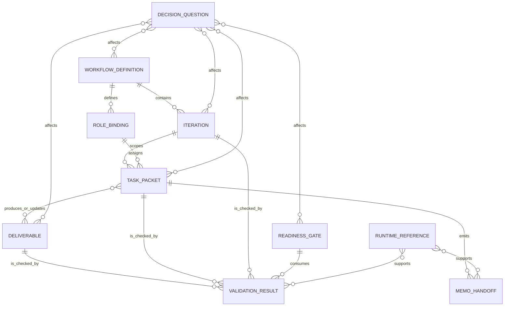
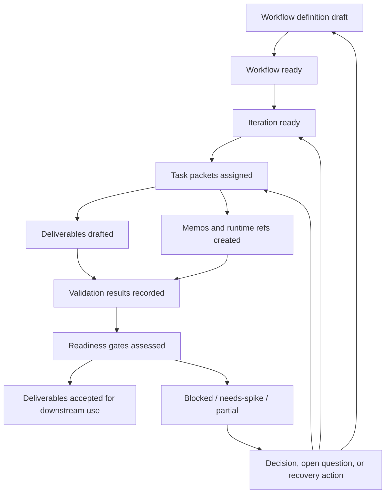

# MVP1 Platform Logical Data Model

- **Status**: draft MVP1 logical data model
- **Owning workflow**: `synapse-concept-to-implementation`
- **Iteration**: `mvp1-iteration-02-entities-models`
- **Domain**: orchestration-framework / CLI-assisted concept-to-implementation
- **Last updated**: 2026-05-03

## Purpose

This document defines a technology-neutral logical data model for MVP1. MVP1 is
a repository-first, CLI-assisted orchestration workflow over the existing
orchestration framework. The model describes the durable and operational data
contracts needed to coordinate workflow definitions, iterations, role-agent task
packets, deliverables, memos, validation, decisions, readiness gates, and
runtime references without selecting a database, storage engine, event
transport, schema registry, or product runtime.

## Source register

| Source | Data-model use |
| --- | --- |
| `docs/refinement/iteration-inputs/mvp1-iteration-02-entities-models.md` | Iteration goal: document state, ownership, lifecycle, data contracts, validation, and relationships while avoiding unsupported stack commitments. |
| `docs/MVP1/Platform/Overview.md` | MVP1 boundary, in-scope platform concepts, deferred runtime concerns, assumptions, and downstream readiness criteria. |
| `docs/MVP1/Platform/Infrastructure.md` | Infrastructure components, canonical paths, task-packet fields, validation scope, state/event posture, and deferred infrastructure. |
| `docs/MVP1/Platform/BusinessEntities.md` | Business entity definitions, ownership, lifecycle states, invariants, relationships, and validation model. |
| `docs/architecture/TECHNICAL_SPECIFICATIONS.md` | Technology-neutral conceptual contracts, future runtime states, event families, observability needs, and open implementation choices. |
| `docs/architecture/DECISIONS.md` | ADR-0011 through ADR-0014: CLI-assisted MVP1, orchestration-framework first domain, Markdown-first metadata, and initial validator scope. |
| `docs/standards/AI_AGENT_STANDARDS.md` | Required task-packet inputs, evidence discipline, completion signals, validation, handoff, safety, and governance standards. |

## Modeling stance

1. **Logical, not physical**: records below are conceptual contracts. They can be
   represented as Markdown sections/tables, YAML workflow configuration, runtime
   task cards, memos, validation summaries, or future structured data.
2. **Markdown-first for MVP1**: ADR-0013 accepts Markdown-first canonical
   metadata. Machine-readable schemas remain deferred until validator work proves
   a concrete need.
3. **Repository-first truth**: committed `docs/` artifacts and
   `.orchestration/config/` define durable MVP1 truth. Runtime files under
   `.orchestration/runtime/` are operational references unless summarized into
   canonical docs or committed configuration.
4. **No storage commitment**: identifiers, fields, relationships, and states are
   defined without choosing persistence, indexing, serialization, event
   transport, API protocol, telemetry backend, tenancy, or deployment model.
5. **Explicit uncertainty**: unsupported runtime, compliance, retention, access,
   UI, provider, and legacy-adapter specifics remain open or future scope.
6. **Immutable source handling**: MVP1 tasks must not modify `raw/` or
   `research/`; canonical docs may cite promoted claims from those sources.

## Logical record catalog

| Logical record | Record/table equivalent | Markdown artifact equivalent | MVP1 responsibility |
| --- | --- | --- | --- |
| Workflow definition | `workflow_definition` | Workflow config, workflow section, or iteration input packet | Defines workflow identity, phases, roles, dependencies, source references, deliverables, gates, and launch/completion criteria. |
| Iteration | `workflow_iteration` | Iteration input packet, handoff section, or run summary | Bounds one execution slice by goal, phase, sources, role work, deliverables, and completion criteria. |
| Role binding | `role_binding` | Role/persona row in workflow config or task packet | Connects a role/persona reference to a workflow step, task packet, boundaries, and reviewer expectations. |
| Task packet | `task_packet` | Generated task card, input packet role section, or task prompt | Defines executable role-agent or reviewer work with sources, prohibited edits, deliverables, dependencies, validation, and handoff audience. |
| Deliverable | `deliverable` | Canonical Markdown artifact or commit-able config file | Tracks expected and produced outputs, ownership, source basis, validation status, and downstream use. |
| Memo/handoff | `memo_handoff` | Agent-sync memo or handoff summary | Coordinates ready-to-consume work, blockers, partial completion, validation notes, and integration context. |
| Validation result | `validation_result` | Validation table, readiness evidence row, or command-output summary | Records deterministic and review-only evidence against task, artifact, iteration, and gate criteria. |
| Decision/open question | `decision_question` | Decision log row, open-question table, assumption/risk section | Captures accepted decisions, assumptions, blockers, validation needs, and unresolved questions. |
| Readiness gate | `readiness_gate` | Readiness checklist, gate table, or handoff acceptance section | Determines whether work can start, continue, hand off, or be accepted. |
| Runtime/log reference | `runtime_reference` | Runtime path, branch/SHA note, log pointer, command-output reference | Provides traceability to generated task cards, memos, logs, CLI runs, and validation commands. |

## Identifier conventions

Identifiers must be stable enough for cross-reference in Markdown and future
validator extraction, but they are not database primary-key commitments.

| Record | Identifier convention | Uniqueness scope | Notes |
| --- | --- | --- | --- |
| Workflow definition | `workflow_id`, such as `synapse-concept-to-implementation` | Repository/workflow config namespace | Should match orchestration configuration or canonical workflow references. |
| Workflow version | `workflow_version` or source revision reference | Within `workflow_id` | MVP1 may use config file revision, git SHA, or explicit version when available. |
| Iteration | `iteration_id`, such as `mvp1-iteration-02-entities-models` | Within `workflow_id` | Must match source packets and generated task references. |
| Phase | `phase_id`, such as `phase-3` | Within `workflow_id` | Supports launch sequencing and dependency checks. |
| Role binding | `role_binding_id` or `{iteration_id}:{role_id}` | Within iteration | Role ID should align with persona/task naming, for example `data_architect`. |
| Task packet | `task_packet_id` or generated task-card ID | Within iteration or workflow run | Must be citeable from handoffs and validation results. |
| Deliverable | Canonical path, such as `docs/MVP1/Platform/DataModel.md` | Repository path namespace | Path is the durable MVP1 identifier for Markdown-first artifacts. |
| Memo/handoff | Runtime memo path plus status/date | Runtime memo namespace | Durable conclusions must be summarized into canonical docs or handoff package. |
| Validation result | `{target_id}:{check_class}:{run_context}` | Within validation roll-up | If no run context exists, use target, check class, reviewer, and date. |
| Decision/open question | ADR/OAD/OQ ID or local `OQ-*` ID | Relevant decision log or deliverable | Must state owner, current guidance, impact, and status. |
| Readiness gate | Gate family plus target, for example `quality:DataModel.md` | Within target artifact or work item | Gate families should align with product, requirements, architecture, quality, dependency, risk, implementation, and agent-output criteria. |
| Runtime/log reference | Path, command label, branch, SHA, or run correlation note | Runtime context | Reference only; not durable product storage. |

## Logical record definitions

### Workflow definition

**Definition**: A workflow-level contract for CLI-assisted orchestration,
including workflow identity, phase order, iteration structure, roles, sources,
deliverables, dependencies, validation expectations, and completion criteria.

**Required logical fields**

| Field | Description |
| --- | --- |
| `workflow_id` | Stable workflow identifier. |
| `name` | Human-readable workflow name. |
| `domain_scope` | Domain or initiative scope; MVP1 uses orchestration-framework / CLI-assisted concept-to-implementation. |
| `version_or_revision` | Version, config revision, or source reference used for reproducibility when available. |
| `phase_ids` | Ordered or dependency-aware phase identifiers. |
| `iteration_ids` | Iterations owned by the workflow. |
| `role_bindings` | Roles/personas assigned to phases, iterations, or task packets. |
| `source_references` | Canonical docs, accepted decisions, and approved input packets. |
| `deliverable_expectations` | Paths or artifact classes expected from workflow execution. |
| `dependencies` | Upstream decisions, gates, phases, or work items required before launch or handoff. |
| `validation_expectations` | Deterministic and review-only checks required before completion. |
| `completion_criteria` | Conditions for treating the workflow or phase as complete. |
| `handoff_audience` | Integrator, reviewer, downstream workflow, or implementation owner. |
| `status` | Lifecycle state. |

**Lifecycle states**

| State | Meaning |
| --- | --- |
| `draft` | Workflow exists but sources, roles, deliverables, dependencies, or gates remain incomplete. |
| `ready` | Required launch metadata and safe-parallelism boundaries are explicit. |
| `running` | CLI-assisted execution has generated or assigned task packets. |
| `blocked` | Missing source, decision, owner, write-target contract, or validation evidence prevents progress. |
| `completed` | Required deliverables, handoffs, and validation/review status are recorded. |
| `retired` | Superseded workflow definition should not be used for new MVP1 work. |

**Retention and audit notes**

- Commit-able workflow configuration and canonical workflow documentation should
  be retained as durable MVP1 truth.
- Runtime task generation output is operational evidence; summarize material
  outcomes into canonical docs or handoff records before relying on them.
- Workflow changes that affect future agent behavior require attribution and
  review before promotion.

### Iteration

**Definition**: A bounded execution slice within a workflow phase, with a goal,
inputs, roles, deliverables, completion criteria, validation expectations, and
handoff rules.

**Required logical fields**

| Field | Description |
| --- | --- |
| `iteration_id` | Stable iteration identifier. |
| `workflow_id` | Parent workflow. |
| `phase_id` | Parent phase or launch context. |
| `goal` | Outcome expected from the iteration. |
| `source_packet` | Input packet or source list that bounds the work. |
| `role_bindings` | Roles assigned to the iteration. |
| `task_packet_ids` | Task packets generated or equivalent role sections. |
| `deliverable_paths` | Expected or produced artifacts. |
| `dependencies` | Prior phases, decisions, gates, or artifacts required for safe execution. |
| `prohibited_edits` | Explicitly prohibited paths or decisions, including `raw/` and `research/`. |
| `completion_criteria` | Testable or reviewable conditions for completion. |
| `validation_summary` | Validation performed, not performed, and review needs. |
| `handoff_status` | Ready, partial, blocked, or complete status for downstream consumers. |

**Lifecycle states**

| State | Meaning |
| --- | --- |
| `planned` | Iteration is known but not launch-ready. |
| `ready` | Inputs, roles, write targets, dependencies, and criteria are explicit. |
| `in-progress` | Role agents or reviewers are executing task packets. |
| `partial-complete` | Useful outputs exist but remaining work or recovery is documented. |
| `blocked` | Missing dependency, source, decision, owner, or validation prevents completion. |
| `complete` | Required deliverables and validation/handoff notes are recorded. |

**Retention and audit notes**

- Iteration input packets and canonical iteration summaries should be retained in
  `docs/` or approved refinement paths.
- Runtime-only task cards and logs should be referenced only as operational
  traceability unless their material content is promoted to canonical docs.

### Role binding

**Definition**: The assignment of a role/persona reference to a workflow,
iteration, task packet, or review responsibility.

**Required logical fields**

| Field | Description |
| --- | --- |
| `role_binding_id` | Stable binding identifier or derived workflow/iteration/role key. |
| `role_id` | Role or persona name, such as `data_architect`. |
| `persona_reference` | Configuration, standards, or inline guidance that defines the role. |
| `scope` | Work boundary for this binding. |
| `responsibilities` | Expected contribution and ownership. |
| `prohibited_actions` | Files, decisions, tools, or claims outside role authority. |
| `evidence_rules` | Source citation and uncertainty requirements. |
| `allowed_deliverables` | Paths or artifact classes this role may create or update. |
| `reviewers` | Review roles required for acceptance where applicable. |
| `status` | Active, blocked, superseded, or draft state. |

**Lifecycle states**

| State | Meaning |
| --- | --- |
| `draft` | Binding needs clarification before task assignment. |
| `active` | Binding may be used for task execution. |
| `blocked` | Role boundaries, tools, evidence rules, or reviewer authority are unclear. |
| `superseded` | Replaced by updated persona guidance or task ownership. |

**Retention and audit notes**

- Reusable role/persona guidance belongs in commit-able configuration or
  standards; one-off role bindings can be captured in task packets.
- Changes to reusable persona behavior require review and attribution.
- MVP1 role bindings are not a product persona registry implementation.

### Task packet

**Definition**: The executable work contract for an agent or human reviewer.

**Required logical fields**

| Field | Description |
| --- | --- |
| `task_packet_id` | Stable task or generated task-card identifier. |
| `iteration_id` | Parent iteration. |
| `role_binding_id` | Assigned role/persona binding. |
| `objective` | Intended outcome and bounded scope. |
| `canonical_sources` | Required `docs/` sources and approved non-doc context. |
| `deliverables` | Exact artifact paths or implementation outputs. |
| `prohibited_edits` | Paths, directories, or decisions the task must not change. |
| `dependencies` | Upstream artifacts, decisions, gates, approvals, or agent outputs. |
| `acceptance_criteria` | Testable or reviewable success criteria. |
| `validation_expectations` | Deterministic checks, review checks, tests, or explicit limits. |
| `handoff_audience` | Downstream role, reviewer, integrator, or orchestrator. |
| `completion_signal` | Standard final signal when task output is complete, partial, blocked, or token-limited. |
| `status` | Lifecycle state. |

**Lifecycle states**

| State | Meaning |
| --- | --- |
| `draft` | Packet is incomplete or unassigned. |
| `ready` | Scope, sources, deliverables, dependencies, validation, and handoff audience are explicit. |
| `assigned` | Agent or reviewer has accepted the packet. |
| `in-progress` | Work is underway. |
| `blocked` | Missing dependency, decision, source, approval, or access boundary prevents progress. |
| `partial-complete` | Some outputs are useful and remaining work is documented. |
| `complete` | Deliverables and completion signal are ready for validation/review. |

**Retention and audit notes**

- Task packets should be retained where they define durable work contracts or
  are needed for handoff reconstruction.
- Completion signals and validation notes should be summarized in durable
  handoff artifacts when downstream work depends on them.

### Deliverable

**Definition**: A reviewable output produced or updated by MVP1 work, usually a
canonical Markdown document or commit-able orchestration configuration file.

**Required logical fields**

| Field | Description |
| --- | --- |
| `deliverable_id` | Canonical path or stable artifact identifier. |
| `title` | Human-readable artifact name. |
| `artifact_type` | Markdown doc, workflow config, standards file, work-item map, validation report, or handoff package. |
| `owner_role` | Producing or accountable role. |
| `reviewer_role` | Role accountable for acceptance where applicable. |
| `source_references` | Canonical docs and accepted decisions supporting the artifact. |
| `source_basis_summary` | Short evidence and assumption summary. |
| `status` | Lifecycle state. |
| `validation_result_ids` | Validation evidence associated with the deliverable. |
| `decision_question_ids` | Decisions, assumptions, or open questions affecting the deliverable. |
| `downstream_consumers` | Work items, roles, or gates that depend on the artifact. |
| `last_updated` | Date or revision metadata when available. |

**Lifecycle states**

| State | Meaning |
| --- | --- |
| `targeted` | Expected by a task packet but not yet created or updated. |
| `draft` | Created or modified but not validated or reviewed. |
| `ready-for-review` | Required content and validation status are present. |
| `needs-revision` | Review or validation found gaps. |
| `accepted` | Fit for downstream use within stated assumptions and open decisions. |
| `superseded` | Replaced by a newer canonical artifact or accepted decision. |

**Retention and audit notes**

- Canonical deliverables under `docs/` should be retained as the durable
  implementation contract.
- Superseded deliverables should retain enough context for traceability through
  git history, decision records, or explicit supersession notes.
- Deliverables must record validation not performed when deterministic checks or
  review gates remain unavailable.

### Memo/handoff

**Definition**: A runtime coordination record for ready-to-consume output,
blockers, partial completion, merge context, validation notes, or follow-up
needs.

**Required logical fields**

| Field | Description |
| --- | --- |
| `memo_id` | Runtime memo path, handoff title, or derived identifier. |
| `producer_role` | Agent or reviewer creating the memo. |
| `audience` | Downstream agent, reviewer, integrator, or orchestrator. |
| `status` | Ready-to-consume, ready-to-merge, blocked, partial, or consumed state. |
| `related_task_packet_id` | Task packet or iteration that produced the memo. |
| `changed_artifacts` | Deliverables created or updated. |
| `validation_summary` | Checks performed, not performed, and evidence limitations. |
| `assumptions_open_questions` | Assumptions, blockers, and unresolved decisions. |
| `runtime_references` | Branch, SHA, log, command, memo, or task-card references when relevant. |
| `follow_up_owner` | Role or owner accountable for next action. |

**Lifecycle states**

| State | Meaning |
| --- | --- |
| `draft` | Memo is incomplete or not safe to consume. |
| `ready-to-consume` | Downstream roles can use the stated output within limitations. |
| `ready-to-merge` | Output is ready for integrator review. |
| `blocked` | Memo records an unresolved blocker or recovery action. |
| `consumed` | Downstream owner has incorporated or acknowledged the memo. |

**Retention and audit notes**

- Runtime memos are operational coordination artifacts, not durable product
  storage.
- Material handoff facts, blockers, or validation evidence should be promoted to
  canonical docs, work items, or decision/open-question logs when they affect
  downstream work.

### Validation result

**Definition**: Evidence that a target satisfies, fails, or requires review for
deterministic or review-only criteria.

**Required logical fields**

| Field | Description |
| --- | --- |
| `validation_result_id` | Stable cross-reference for this validation result. |
| `target_type` | Workflow, iteration, task packet, deliverable, memo, gate, or work item. |
| `target_id` | Identifier of the checked target. |
| `check_class` | Required files, required sections, trace markers, ID format, source immutability, completion signal, or review-only quality. |
| `criteria` | Specific rule or expectation checked. |
| `status` | Not-run, passed, failed, review-needed, or not-applicable. |
| `evidence` | Command output, reviewer rationale, file path, section reference, or limitation. |
| `run_context` | Date, branch, SHA, command, reviewer, or runtime reference when available. |
| `follow_up_owner` | Owner for failures, review needs, or recovery actions. |
| `related_decision_question_ids` | Open questions or decisions raised by the result. |

**Lifecycle states**

| State | Meaning |
| --- | --- |
| `not-run` | Expected validation has not been performed. |
| `passed` | Criteria were satisfied. |
| `failed` | Criteria were not satisfied and gaps are listed. |
| `review-needed` | Human review is required because deterministic validation is insufficient. |
| `not-applicable` | Criterion does not apply and rationale is recorded. |

**Retention and audit notes**

- Validation summaries that affect handoff readiness should be retained in
  canonical artifacts or final handoff packages.
- Command output can remain as a runtime reference if summarized sufficiently for
  downstream trust.
- Failed validation should always link to a recovery owner, open question, or
  blocker.

### Decision/open question

**Definition**: A recorded accepted decision, proposed decision, assumption,
blocker, validation need, or open question that affects scope, sequencing, data
contracts, implementation readiness, or future architecture.

**Required logical fields**

| Field | Description |
| --- | --- |
| `decision_question_id` | ADR/OAD/OQ ID or local open-question identifier. |
| `kind` | Accepted decision, open question, assumption, blocker, validation need, or deferred decision. |
| `status` | Proposed, open, needs-spike, accepted, deferred, or superseded. |
| `statement` | Decision or question text. |
| `current_guidance` | What MVP1 work should do until the item changes. |
| `affected_entities` | Workflow definitions, tasks, deliverables, gates, validations, or future areas affected. |
| `impact` | Why the decision/question matters. |
| `owner_or_reviewer` | Role accountable for resolution or acceptance. |
| `source_references` | Canonical decision records, docs, or evidence. |
| `revisit_gate` | Future gate, MVP, or spike where deferred/open work should be revisited. |

**Lifecycle states**

| State | Meaning |
| --- | --- |
| `proposed` | Candidate decision or question has been identified. |
| `open` | Answer is unknown and may affect downstream work. |
| `needs-spike` | Bounded discovery is required before resolution. |
| `accepted` | Decision is approved and can be cited. |
| `deferred` | Explicitly outside MVP1 or assigned to a later gate. |
| `superseded` | Replaced by a newer accepted decision. |

**Retention and audit notes**

- Accepted decisions should be retained in canonical decision logs or cited
  directly from canonical deliverables.
- Open questions that affect implementation readiness should remain visible in
  deliverables, readiness gates, or work-item records until resolved or deferred.

### Readiness gate

**Definition**: A structured checkpoint used to determine whether work can
start, continue, hand off, or be accepted.

**Required logical fields**

| Field | Description |
| --- | --- |
| `readiness_gate_id` | Stable gate identifier. |
| `gate_family` | Product, requirements traceability, architecture/technical, quality, dependency, risk, implementation, or agent-output. |
| `target_type` | Workflow, iteration, task packet, deliverable, work item, or handoff. |
| `target_id` | Identifier of the gated target. |
| `criteria` | Readiness condition. |
| `status` | Not-started, ready, blocked, needs-spike, or not-applicable. |
| `evidence` | Validation result, reviewer rationale, source reference, or limitation. |
| `owner_or_reviewer` | Role accountable for assessment. |
| `blocking_decision_question_ids` | Open decisions/questions that block readiness. |
| `recovery_action` | Follow-up needed when the gate is not ready. |

**Lifecycle states**

| State | Meaning |
| --- | --- |
| `not-started` | Gate has not been assessed. |
| `ready` | Gate is satisfied and evidence is linked. |
| `blocked` | Required decision, dependency, source, owner, or approval is missing. |
| `needs-spike` | Discovery is required before readiness can be assessed. |
| `not-applicable` | Gate does not apply and rationale is recorded. |

**Retention and audit notes**

- Gate assessments that determine downstream work should be retained in
  work-item docs, deliverables, validation roll-ups, or handoff packages.
- Review-only gate evidence must name the reviewer role and limitation.

### Runtime/log reference

**Definition**: A pointer to operational context produced during CLI-assisted
execution, such as generated task cards, agent memos, CLI logs, branch names,
SHAs, validation command output, or terminal/run context.

**Required logical fields**

| Field | Description |
| --- | --- |
| `runtime_reference_id` | Path, branch/SHA reference, command label, or derived identifier. |
| `reference_type` | Task card, memo, log, command output, branch, SHA, validation run, or CLI invocation. |
| `location` | Path, command name, repository reference, or other locator. |
| `created_by` | Agent, orchestrator, validator, or reviewer that produced the reference. |
| `related_target_ids` | Workflow, iteration, task, deliverable, memo, or validation target. |
| `summary` | Material content or reason the reference matters. |
| `durability` | Operational-only, summarized, canonicalized, or unavailable. |
| `limitations` | Missing access, partial logs, non-durable runtime location, or other caveat. |

**Lifecycle states**

| State | Meaning |
| --- | --- |
| `created` | Reference exists during workflow execution. |
| `linked` | Handoff, validation result, or deliverable cites the reference. |
| `summarized` | Canonical artifact captures the relevant context. |
| `discardable` | Operational-only and not needed for durable handoff. |
| `unavailable` | Reference cannot be inspected; downstream artifacts state the gap. |

**Retention and audit notes**

- Runtime/log references are traceability aids, not canonical product storage.
- Material findings must be summarized into `docs/`, work items, decisions, or
  commit-able configuration before downstream work treats them as durable.

## Relationship model and cardinality

| Relationship | Cardinality | Rule |
| --- | --- | --- |
| Workflow definition to iteration | One to many | Every iteration belongs to one workflow definition context. |
| Workflow definition to role binding | One to many | Workflows can define many role bindings; a binding may be reused by many task packets. |
| Iteration to task packet | One to many | Each role-agent or reviewer assignment should be represented by a task packet or equivalent bounded role section. |
| Role binding to task packet | One to many | A task packet has one primary role binding; it may name additional reviewers. |
| Task packet to deliverable | Many to many | One task may update multiple deliverables, and one deliverable may receive coordinated updates from multiple tasks; shared deliverables require explicit ownership or merge contract. |
| Task packet to memo/handoff | One to many | Tasks should emit handoff context when complete, partial, blocked, or ready-to-consume. |
| Deliverable to validation result | One to many | Deliverables may have multiple deterministic and review-only validation results. |
| Iteration/task packet to validation result | One to many | Execution contracts and completion signals may be validated separately from deliverable content. |
| Readiness gate to validation result | One to many | Gates consume validation evidence and reviewer rationale. |
| Decision/open question to modeled records | Many to many | Decisions and questions may affect any workflow, iteration, task, artifact, validation, or gate. |
| Runtime/log reference to memo or validation result | Many to many | Runtime context supports traceability but must be summarized when durable. |

## Cross-record lifecycle

## Data quality rules

| Rule family | Rule |
| --- | --- |
| Required metadata | Workflow definitions, iterations, and task packets must name role/objective, canonical sources, deliverables, prohibited edits, dependencies, acceptance criteria, validation expectations, and handoff audience. |
| Canonical paths | Durable implementation truth must live in canonical `docs/` paths or commit-able `.orchestration/config/` files. |
| Source immutability | MVP1 tasks must not modify `raw/` or `research/`; validation should detect prohibited modifications. |
| Identifier stability | Workflow, iteration, phase, task, deliverable, decision, gate, and validation identifiers must be stable enough for Markdown cross-reference. |
| Evidence classification | Material claims affecting scope, architecture, data contracts, validation, security/privacy, dependencies, or operations must be source-backed, inferred, assumed, or open. |
| Completion signals | Agent completion must use `TASK_COMPLETE`, `TOKEN_BUDGET_LOW`, `BLOCKED`, or `PARTIAL_COMPLETE` where task-packet standards apply. |
| Validation status | Every deliverable or handoff must state validation performed, validation not performed, review needs, and limitations. |
| Review-only labeling | Criteria that cannot be deterministically checked must be labeled review-only and assigned to a reviewer role. |
| Shared artifact ownership | Shared write targets require one owner or explicit coordination/merge contract. |
| Future-scope protection | Runtime, persistence, event transport, schema registry, tenancy, compliance, provider, UI, and legacy-adapter specifics must remain open/future unless backed by accepted decisions. |
| Recovery traceability | Failed validation, blocked gates, and partial completions must include owner, impact, and recovery guidance. |

## Retention, audit, and governance notes

| Data class | MVP1 retention/audit posture |
| --- | --- |
| Canonical deliverables | Retain in `docs/` as durable implementation contracts; changes are auditable through repository history and decision references. |
| Workflow configuration | Retain commit-able configuration needed to reproduce task generation or workflow launch semantics. |
| Iteration input packets | Retain as reviewed inputs that bound agent work and prevent duplicate/ambiguous task generation. |
| Task packets | Retain when they define durable work contracts or when needed to reconstruct handoffs; operational generated copies can be summarized. |
| Memos/handoffs | Treat runtime memos as operational; promote material blockers, validation status, and assumptions into durable docs or handoff packages. |
| Validation results | Retain roll-ups that affect readiness or downstream implementation; detailed command output may remain as referenced runtime context. |
| Decisions/open questions | Retain accepted decisions and unresolved blockers in canonical decision/open-question logs or deliverable sections. |
| Readiness gates | Retain gate outcomes and evidence when they authorize downstream work or explain blocked/partial status. |
| Runtime/log references | Retain or cite only as needed for traceability; summarize material findings because runtime artifacts are not durable product storage. |

MVP1 does not define retention periods, data deletion policy, access-control
policy, audit-ledger technology, compliance controls, or sensitive-data handling
beyond repository and task-boundary expectations. Those items remain open
architecture and governance decisions.

## MVP1 validation mapping

| ADR-0014 check class | Logical targets | Expected MVP1 evidence |
| --- | --- | --- |
| Required files | Deliverables, handoff packages, workflow config | Expected path exists or is marked blocked/partial with recovery notes. |
| Required sections/headings | Deliverables, task packets, readiness records | Required review and handoff sections are present. |
| Trace markers | Work items, requirements-linked artifacts, gates | PRD/FR references and `E##` / `US-E##-###` IDs appear where applicable. |
| ID format | Work items, iterations, gates, task references | IDs follow accepted local conventions or document a local convention. |
| Source immutability | All task outputs | No `raw/` or `research/` modifications. |
| Completion-signal format | Task packets and handoffs | Standard completion signal is present when specialist-agent standards apply. |
| Review-only quality | Assumptions, evidence sufficiency, risk, architecture fit | Reviewer role, rationale, limitations, and follow-up owner are recorded. |

## Explicit future scope

The logical model intentionally does not define or imply implementation of:

- Persisted workflow-run database schema, state-store technology, or migration
  strategy.
- Production workflow runtime, scheduler, retry engine, pause/resume service,
  hosted API, or workflow execution backend.
- Concrete event transport, schema format, schema registry, replay mechanism,
  dead-letter system, or event serialization format.
- Visual workflow designer UI, graph serialization, diff strategy, template
  publication workflow, or canvas data format.
- Product persona registry, inheritance engine, prompt-management service, or
  provider-specific agent runtime integration.
- Knowledge retrieval store, source inventory service, SME freshness scoring,
  confidence-scoring implementation, or retrieval API.
- Human approval automation, approval queues, access policy engine, or durable
  approval ledger implementation.
- Tenancy, access control, sensitive-data handling, compliance controls,
  retention periods, data deletion policy, or deployment model.
- Legacy bridge adapter set, authentication model, permission model, rate-limit
  policy, or customer-specific transition corpus.
- Runtime telemetry store, metrics backend, trace system, monitoring UI, or
  operational alerting.

## Assumptions

- The existing orchestration framework provides enough CLI-assisted mechanics
  for MVP1 workflow/task-packet execution, handoffs, and validation references.
- Markdown-first structured sections and tables are sufficient for MVP1 data
  contracts until E03 validator work identifies a concrete schema need.
- Canonical docs and commit-able orchestration configuration are the durable
  sources of truth; runtime memos and logs are operational references.
- Human reviewers remain accountable for accepting review-only quality,
  readiness gates, architecture fit, and unresolved decision impact.
- Path-based deliverable identifiers are adequate for MVP1 because repository
  artifacts are the implementation contract.

## Open decisions and questions

| ID | Question or decision needed | Current MVP1 handling |
| --- | --- | --- |
| OQ-DM-001 | Which MVP1 fields need machine-readable extraction for E03 validators? | Keep Markdown-first contracts; introduce schemas only after a bounded validator spike proves need. |
| OQ-DM-002 | Who is the final accountable approver for each readiness gate family? | Use role-based gate ownership from standards and technical refinement guidance until named owners are accepted. |
| OQ-DM-003 | What runtime workflow, task, audit, event, and approval records become durable product entities after MVP1? | Model them conceptually only; defer persistence and runtime commitments to future architecture decisions. |
| OQ-DM-004 | What retention, deletion, sensitive-data, tenancy, and compliance rules apply to future product records? | Treat as open governance decisions; do not encode implementation-specific retention or access claims in MVP1. |
| OQ-DM-005 | How should runtime memos/logs be promoted or summarized when they contain reusable process learnings? | Promote material outcomes through canonical docs, workflow templates, personas, validators, or backlog gates after review. |
| OQ-DM-006 | What future source inventory, persona registry, knowledge-grounding, and telemetry records are needed for MVP2+? | Keep these as future scope until MVP1 handoff and subsequent workflow domains clarify requirements. |

