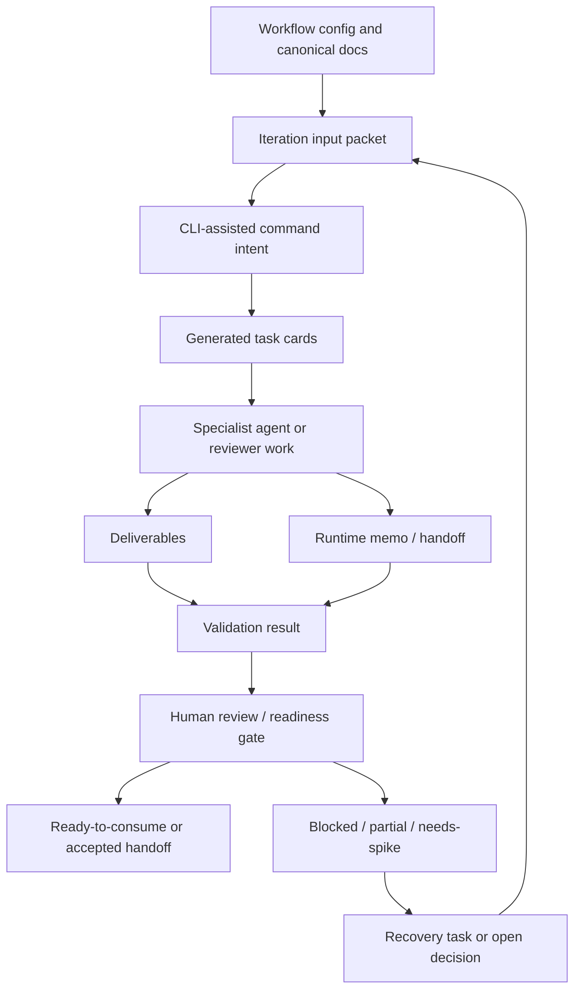

# MVP1 Platform Integrations

- **Status**: draft MVP1 integration contracts
- **Owning workflow**: `synapse-concept-to-implementation`
- **Iteration**: `mvp1-iteration-03-integrations`
- **Domain**: orchestration-framework / CLI-assisted concept-to-implementation
- **Last updated**: 2026-05-03

## Purpose

This document defines technology-neutral integration contracts for MVP1. MVP1 is
a repository-first, CLI-assisted orchestration workflow over the existing
orchestration framework. These contracts describe how workflow configuration,
input packets, generated task cards, agent memos, validation results, human
review gates, telemetry/log references, and recovery signals hand off context
without selecting event transport, API protocol, storage, runtime, deployment,
or provider technology.

## Source register

| Source | Integration-contract use |
| --- | --- |
| `docs/refinement/iteration-inputs/mvp1-iteration-03-integrations.md` | Iteration goal and completion criteria for synchronous, asynchronous, human-in-loop, telemetry, failure, and ownership flows. |
| `docs/MVP1/Platform/Overview.md` | MVP1 boundary, repository-first thesis, in-scope platform concepts, and deferred runtime concerns. |
| `docs/MVP1/Platform/Infrastructure.md` | CLI-assisted infrastructure components, canonical paths, validation posture, state/event posture, and deferred infrastructure. |
| `docs/MVP1/Platform/BusinessEntities.md` | Entity ownership, lifecycle states, handoff invariants, validation rules, and recovery expectations. |
| `docs/MVP1/Platform/DataModel.md` | Logical identifiers, required fields, relationship model, data quality rules, and retention/audit notes. |
| `docs/architecture/TECHNICAL_SPECIFICATIONS.md` | Future component capabilities, conceptual task/event/approval contracts, observability requirements, and open implementation choices. |
| `docs/architecture/DECISIONS.md` | ADR-0011 through ADR-0014 and open architecture decisions for runtime, event transport, schema registry, API protocol, storage, approval policy, and governance. |
| `docs/standards/AI_AGENT_STANDARDS.md` | Required task-packet inputs, evidence discipline, output quality, completion signals, validation, handoff, and governance rules. |

## Integration stance

1. **Command and document contracts, not product APIs**: MVP1 integration
   boundaries are expressed through CLI command intents, workflow configuration,
   input packets, task cards, memos, validation summaries, and canonical docs.
2. **Technology neutral by default**: Contracts define owners, identifiers,
   logical fields, states, correlation needs, and failure behavior without
   choosing API protocol, event transport, storage, schema registry, runtime, or
   telemetry backend.
3. **Repository-first durable truth**: Canonical `docs/` artifacts and
   commit-able `.orchestration/config/` files are durable contracts. Runtime task
   cards, memos, and logs are operational references until summarized into
   canonical docs or handoff packages.
4. **Human review is an integration boundary**: Review and approval points are
   modeled as gates with named reviewer roles, evidence, rationale, and recovery
   outcomes, not as an automated approval service for MVP1.
5. **Validation before downstream reliance**: Downstream work can consume a
   deliverable only when deterministic validation, review-only status, or an
   explicit blocked/partial recovery path is recorded.
6. **Failures become recoverable handoffs**: Missing inputs, invalid task
   packets, partial completions, token limits, validation failures, and shared
   artifact conflicts must produce actionable recovery context.

## Integration participants and ownership

| Participant | Owns | Consumes | Integration responsibilities |
| --- | --- | --- | --- |
| Orchestrator | Workflow launch intent, task generation boundaries, runtime organization, recovery routing | Canonical docs, workflow config, input packets, role/persona references, validation gaps | Ensure commands are scoped, task packets have required fields, generated work has handoff audiences, and blocked/partial states are routed to recovery. |
| Specialist agent | Assigned deliverables, completion signal, runtime memo accuracy | Task packet, canonical sources, prohibited edits, validation expectations | Produce or update scoped artifacts, preserve evidence discipline, record validation performed/not performed, and emit safe handoff context. |
| Integrator | Convergence, shared artifact reconciliation, final handoff readiness | Ready-to-consume memos, validation results, runtime/log references, open decisions | Reconcile outputs, identify conflicts, decide whether material runtime context must be promoted to canonical docs, and record downstream readiness. |
| Reviewer | Review-only validation and approval/risk decisions | Deliverables, evidence summaries, validation results, open questions | Accept, reject, request changes, or escalate based on named gate criteria and evidence. |
| Validator owner | Deterministic validation checks and result summaries | Expected deliverables, task-packet metadata, completion signals, source immutability rules | Record pass/fail/review-needed status, evidence, limitations, and follow-up owners. |
| Configuration/standards owner | Reusable workflow, persona, standards, and validator contract changes | Recurring process learnings and review feedback | Review behavior-affecting updates before promotion into reusable assets. |

## Identifier and correlation conventions

Identifiers must be stable enough for Markdown cross-reference and future
validator extraction. They are not database primary-key, endpoint, or event
schema commitments.

| Integration object | Identifier expectation | Correlation expectation |
| --- | --- | --- |
| CLI command invocation | Command label plus workflow/phase/iteration arguments when available | Correlate to `workflow_id`, `phase_id`, `iteration_id`, operator/agent context, and runtime/log reference. |
| Workflow configuration | `workflow_id`, optional `version_or_revision`, `phase_id`, and `iteration_id` | Correlate to source packet, role bindings, deliverable expectations, and launch gate status. |
| Input packet | Canonical path plus `workflow`, `phase`, and `iteration` metadata | Correlate to generated task cards and required role source references. |
| Generated task card | `task_packet_id` or generated task-card path | Correlate to iteration, role binding, deliverables, dependencies, validation expectations, and handoff audience. |
| Memo/handoff | Runtime memo path plus date/status/audience | Correlate to task packet, changed artifacts, validation summary, branch/SHA when applicable, and follow-up owner. |
| Validation result | `{target_id}:{check_class}:{run_context}` or equivalent stable label | Correlate to target artifact/task/gate, evidence, status, reviewer/validator, and recovery action. |
| Human review gate | Gate family plus target, for example `architecture:Integrations.md` | Correlate to evidence reviewed, decision, rationale, affected downstream work, and recovery path. |
| Telemetry/log reference | Runtime path, command label, branch, SHA, or run context | Correlate to workflow/iteration/task/deliverable and summarize material findings into durable artifacts when needed. |

## CLI command boundaries

MVP1 command contracts are described by intent and required inputs/outputs. They
do not define a hosted API or stable command-line interface beyond the current
CLI-assisted operating model.

| Boundary | Initiator | Required inputs | Expected outputs | Validation and handoff |
| --- | --- | --- | --- | --- |
| Workflow start | Orchestrator or authorized operator | `workflow_id`, `phase_id`, `iteration_id`, source packet path, accepted upstream gates, role/persona configuration, deliverable expectations | Runtime workflow/run context, generated or assigned task cards, runtime/log reference | Confirm required inputs exist, unsafe parallelism is addressed, and generated tasks include required packet fields. |
| Task generation | Orchestrator | Workflow config, role binding, canonical sources, deliverables, prohibited edits, dependencies, validation expectations, handoff audience | Task card or equivalent role packet | Validate packet completeness before assignment; mark blocked if role, source, write target, or dependency is unclear. |
| Agent execution | Specialist agent | Assigned task packet, canonical sources, branch/workspace context, standards, validation expectations | Updated deliverables, completion signal, memo/handoff, runtime/log references | Record changed artifacts, assumptions/open questions, validation performed/not performed, prohibited-edit confirmation, and handoff status. |
| Validation run | Validator owner, agent, or integrator | Target artifacts/task packets/gates, expected check classes, run context | Validation result summary and evidence reference | Use ADR-0014 scope: required files, required sections, trace markers, ID format, source immutability, and completion-signal format; label review-only checks. |
| Review/approval checkpoint | Reviewer, integrator, or orchestrator | Deliverable, evidence summary, validation result, risk/open-decision context, requested decision | Review decision: approve, reject, request changes, escalate, or defer | Record reviewer role, rationale, evidence reviewed, affected downstream work, and recovery action. |
| Recovery or rerun | Orchestrator, integrator, or follow-up owner | Blocker, failed validation, partial completion, token-limit note, conflict, or missing evidence | Revised task packet, follow-up work item, blocked status, or accepted limitation | Preserve useful output, assign owner, narrow scope, and prevent downstream reliance until recovery status is explicit. |

## Contract catalog

### IC-001: Workflow config to input packet flow

**Flow type**: synchronous setup and review handoff.

**Purpose**: Convert commit-able workflow configuration and canonical iteration
inputs into a bounded execution packet for one MVP1 iteration.

**Producer**: Orchestrator or configuration owner.

**Consumers**: Specialist agents, validators, integrators, and reviewers.

**Required logical fields**

| Field | Expectation |
| --- | --- |
| `workflow_id` | Stable workflow identifier, such as `synapse-concept-to-implementation`. |
| `phase_id` | Phase or launch context, such as `phase-4`. |
| `iteration_id` | Stable iteration identifier, such as `mvp1-iteration-03-integrations`. |
| `iteration_goal` | Outcome expected from the iteration. |
| `role_bindings` | Roles assigned to the iteration and their source references. |
| `canonical_sources` | Required `docs/` sources and approved input packets. |
| `deliverable_expectations` | Exact target paths or artifact classes. |
| `prohibited_edits` | Paths and decisions outside scope, including `raw/` and `research/`. |
| `dependencies` | Upstream artifacts, decisions, gates, or agent outputs required for safe execution. |
| `completion_criteria` | Conditions for treating iteration outputs as complete. |
| `validation_expectations` | Deterministic and review-only checks required before handoff. |

**State expectations**: `draft`, `ready`, `running`, `blocked`, `completed`, or
`retired` for workflow/config; `planned`, `ready`, `in-progress`,
`partial-complete`, `blocked`, or `complete` for iteration execution.

**Failure and recovery**

- Missing sources, ambiguous write targets, or unresolved role boundaries block
  launch until corrected or reframed as discovery.
- Duplicate task-card generation risk should be handled by a single input packet
  that contains role-specific source references and completion criteria.
- If configuration and input packet disagree, the orchestrator or integrator
  records the conflict and assigns one owner for resolution before dispatch.

### IC-002: Input packet to generated task card flow

**Flow type**: synchronous command output with asynchronous downstream work.

**Purpose**: Turn the iteration packet into executable role-agent or reviewer
work without losing scope, evidence, validation, and handoff expectations.

**Producer**: Orchestrator or task generator.

**Consumers**: Assigned specialist agent, reviewer, validator, and integrator.

**Required logical fields**

| Field | Expectation |
| --- | --- |
| `task_packet_id` | Generated identifier or task-card path. |
| `iteration_id` | Parent iteration. |
| `role_binding_id` | Assigned role/persona binding. |
| `objective` | Role-scoped outcome. |
| `canonical_sources` | Required source-of-truth paths. |
| `deliverables` | Exact output paths the assignee may create or update. |
| `prohibited_edits` | Explicitly prohibited paths, directories, or decisions. |
| `dependencies` | Blocking artifacts, decisions, gates, or tasks. |
| `acceptance_criteria` | Testable or reviewable success criteria. |
| `validation_expectations` | Deterministic checks, review checks, tests, or explicit limits. |
| `handoff_audience` | Downstream role, reviewer, integrator, or orchestrator. |
| `completion_signal` | Expected final signal format. |

**State expectations**: `draft`, `ready`, `assigned`, `in-progress`, `blocked`,
`partial-complete`, or `complete`.

**Failure and recovery**

- A generated task card that lacks required fields remains `draft` or `blocked`
  and should not be assigned as implementation-ready work.
- Shared deliverables require one owner or explicit merge contract before
  parallel execution.
- If a task exceeds token or scope limits, the completion signal should be
  `TOKEN_BUDGET_LOW` or `PARTIAL_COMPLETE` with remaining paths and recovery
  split.

### IC-003: Agent execution to deliverable and memo handoff flow

**Flow type**: asynchronous work completion and handoff.

**Purpose**: Communicate agent-produced artifacts, assumptions, validation
status, blockers, and downstream safety through a runtime memo or equivalent
handoff summary.

**Producer**: Specialist agent or reviewer.

**Consumers**: Integrator, downstream agents, validators, reviewers, and
orchestrator.

**Required logical fields**

| Field | Expectation |
| --- | --- |
| `memo_id` | Runtime memo path or handoff title. |
| `producer_role` | Agent or reviewer creating the handoff. |
| `audience` | Intended consumer, such as integrator or downstream role. |
| `status` | `draft`, `ready-to-consume`, `ready-to-merge`, `blocked`, `partial`, or `consumed` as locally applicable. |
| `related_task_packet_id` | Task packet or iteration that produced the memo. |
| `changed_artifacts` | Deliverables created or updated. |
| `validation_summary` | Checks performed, not performed, evidence, and limitations. |
| `assumptions_open_questions` | Assumptions, blockers, deferred decisions, and review needs. |
| `runtime_references` | Branch, SHA, log, command, memo, or task-card references when relevant. |
| `follow_up_owner` | Owner for next action, review, recovery, or merge. |
| `completion_signal` | `TASK_COMPLETE`, `TOKEN_BUDGET_LOW`, `BLOCKED`, or `PARTIAL_COMPLETE` when specialist-agent standards apply. |

**State expectations**: A `ready-to-consume` memo means downstream roles can rely
on the stated content within recorded limitations. A `blocked` or `partial`
memo must include recovery action.

**Failure and recovery**

- Missing validation status prevents the handoff from being treated as complete;
  the memo should name validation not performed and the owner for follow-up.
- Material runtime-only facts must be summarized into canonical docs, work
  items, decisions, or final handoff packages before downstream implementation
  relies on them.
- If prohibited files were changed, the handoff must identify impact and a
  recovery owner; MVP1 tasks must not modify `raw/` or `research/`.

### IC-004: Validation result flow

**Flow type**: synchronous check execution with asynchronous review follow-up
when needed.

**Purpose**: Record deterministic and review-only evidence about whether a
workflow, task packet, deliverable, memo, readiness gate, or handoff satisfies
MVP1 criteria.

**Producer**: Validator owner, specialist agent, reviewer, or integrator.

**Consumers**: Integrator, reviewers, downstream agents, orchestrator, and
future validator refinement work.

**Required logical fields**

| Field | Expectation |
| --- | --- |
| `validation_result_id` | Stable reference such as `{target_id}:{check_class}:{run_context}`. |
| `target_type` | Workflow, iteration, task packet, deliverable, memo, gate, or work item. |
| `target_id` | Identifier of the checked target. |
| `check_class` | Required files, required sections, trace markers, ID format, source immutability, completion signal, or review-only quality. |
| `criteria` | Specific rule or expectation checked. |
| `status` | `not-run`, `passed`, `failed`, `review-needed`, or `not-applicable`. |
| `evidence` | Command output summary, file path, section reference, reviewer rationale, or limitation. |
| `run_context` | Date, branch, SHA, command label, reviewer, or runtime reference when available. |
| `follow_up_owner` | Owner for failures, review needs, or recovery actions. |
| `related_decision_question_ids` | Open questions, blockers, or decisions raised by the result. |

**State expectations**: Failed validation creates a recovery obligation; review
needed creates a human gate; not applicable requires rationale.

**Failure and recovery**

- Validation failure should identify exact target, failed criterion, impact,
  owner, and recommended recovery.
- Deterministic validators must not imply subjective approval; quality,
  evidence sufficiency, architecture fit, risk acceptance, and open-decision
  impact remain review-only unless later standards change.
- Repeated validation gaps should be candidates for standards, workflow
  templates, task packets, or validator improvements after review.

### IC-005: Human review and approval flow

**Flow type**: human-in-the-loop gate.

**Purpose**: Preserve accountability for review-only quality, architecture fit,
security/privacy concerns, risk, dependencies, implementation readiness, and
behavior-affecting changes.

**Producer**: Orchestrator, integrator, validator, or specialist agent requesting
review.

**Consumers**: Reviewer, integrator, downstream task owner, and configuration or
standards owner when reusable assets are affected.

**Required logical fields**

| Field | Expectation |
| --- | --- |
| `readiness_gate_id` | Gate family plus target identifier. |
| `gate_family` | Product, requirements traceability, architecture/technical, quality, dependency, risk, implementation, security/privacy, or agent-output. |
| `target_type` | Workflow, iteration, task packet, deliverable, work item, reusable config, or handoff. |
| `target_id` | Identifier of the gated target. |
| `reviewer_role` | Role accountable for the decision. |
| `evidence_reviewed` | Deliverables, validation results, runtime summaries, decisions, assumptions, or risks reviewed. |
| `decision` | Approve, reject, request changes, escalate, defer, or mark not applicable. |
| `rationale` | Reason for decision and limits of approval. |
| `affected_downstream_work` | Work that may proceed or must wait. |
| `recovery_action` | Follow-up needed when not approved. |

**Human approval points in MVP1**

| Gate | Trigger | Reviewer expectation | Downstream effect |
| --- | --- | --- | --- |
| Workflow launch readiness | Sources, roles, deliverables, dependencies, or validation expectations are incomplete or risky | Orchestrator, tech lead, or integrator | Launch proceeds, is narrowed, or is blocked. |
| Shared artifact ownership | Multiple agents may update the same deliverable | Integrator | One owner or merge contract is assigned before parallel work. |
| Deliverable acceptance | Canonical artifact is ready for downstream reliance | Domain reviewer, architect, or integrator | Artifact becomes ready-to-consume, needs revision, or remains blocked. |
| Validation exception | Deterministic check fails, is unavailable, or is insufficient | Validator owner or gate-specific reviewer | Recovery task, accepted limitation, or review-only approval is recorded. |
| Behavior-affecting reusable asset change | Workflow template, persona, standard, or validator rule would affect future agents | Configuration/standards owner and reviewer | Change is accepted, rejected, or deferred to future scope. |
| Security/privacy/governance concern | Sensitive data, tenancy, access, compliance, retention, or approval policy affects implementation claims | Security/privacy or governance reviewer | Implementation-specific claim is blocked, deferred, or escalated. |

**Failure and recovery**

- Lack of named reviewer blocks review-only approval.
- Rejection or request-changes should create a recovery task, revised task
  packet, or documented open decision.
- Escalated decisions should name affected work and current safe guidance.

### IC-006: Telemetry and log reference flow

**Flow type**: telemetry/reference flow.

**Purpose**: Preserve traceability from command invocation, generated tasks,
agent execution, validation, and review decisions to material outcomes without
creating a telemetry backend commitment.

**Producer**: CLI-assisted orchestration, agents, validators, reviewers, and
integrators.

**Consumers**: Integrator, reviewers, orchestrator, future observability work,
and recovery owners.

**Required logical fields**

| Field | Expectation |
| --- | --- |
| `runtime_reference_id` | Path, branch/SHA reference, command label, or derived identifier. |
| `reference_type` | CLI invocation, task card, memo, log, command output, branch, SHA, validation run, review note, or handoff summary. |
| `location` | Path, command name, repository reference, or locator. |
| `created_by` | Agent, orchestrator, validator, reviewer, or integrator. |
| `related_target_ids` | Workflow, iteration, task, deliverable, memo, validation, or gate target. |
| `summary` | Material content or reason the reference matters. |
| `durability` | Operational-only, summarized, canonicalized, or unavailable. |
| `limitations` | Missing access, partial logs, runtime-only path, non-durable context, or other caveat. |

**Telemetry signals to preserve conceptually**

| Signal family | Examples | MVP1 use |
| --- | --- | --- |
| Workflow/task progress | Started, assigned, completed, blocked, partial | Summarize execution state and handoff safety. |
| Agent completion | `TASK_COMPLETE`, `TOKEN_BUDGET_LOW`, `BLOCKED`, `PARTIAL_COMPLETE` | Route success, recovery, or follow-up work. |
| Validation status | Passed, failed, review-needed, not-run | Support readiness gates and recovery decisions. |
| Human review | Approved, rejected, requested changes, escalated, deferred | Preserve accountability and downstream gating. |
| Quality/process learning | Repeated validation gap, task-packet defect, handoff ambiguity | Candidate updates to standards, templates, validators, or backlog gates after review. |

**Failure and recovery**

- Missing runtime/log references should be recorded as limitations when they
  affect trust or reproducibility.
- Operational-only logs are not durable product storage; material findings must
  be summarized into canonical docs or handoff packages.
- Telemetry gaps that hide repeated blockers, token-budget failures, or quality
  defects should create future observability or validator backlog items.

### IC-007: Failure, partial completion, and recovery flow

**Flow type**: asynchronous exception and recovery handoff.

**Purpose**: Convert interrupted, invalid, partial, or conflicted execution into
bounded follow-up work while preserving useful output and downstream safety.

**Producer**: Any participant that detects a blocker, failure, partial output,
missing evidence, or unsafe dependency.

**Consumers**: Orchestrator, integrator, follow-up owner, reviewer, validator,
and downstream agents.

**Required logical fields**

| Field | Expectation |
| --- | --- |
| `failure_or_recovery_id` | Stable local label or reference to memo, validation result, gate, or task packet. |
| `trigger` | Missing source, invalid packet, command failure, token limit, partial output, failed validation, review rejection, conflict, prohibited edit, or open decision. |
| `affected_targets` | Workflows, iterations, tasks, deliverables, gates, or decisions affected. |
| `current_state` | Blocked, partial-complete, failed, review-needed, not-run, or needs-spike. |
| `impact` | What downstream work can proceed and what must wait. |
| `preserved_output` | Useful artifacts or context already produced. |
| `recovery_action` | Correct packet, rerun, narrow scope, assign owner, review decision, create follow-up, or accept documented limitation. |
| `owner` | Role accountable for recovery. |
| `validation_needed` | Checks or review required before downstream reliance resumes. |

**Recovery rules**

- Preserve useful output before assigning follow-up work.
- Make partial and blocked states explicit through completion signal, memo, and
  validation or readiness status.
- Assign one owner for shared artifact conflicts.
- Reframe implementation-specific unknowns as open decisions or technology-neutral
  refinement instead of inventing runtime, storage, event, API, provider,
  tenancy, compliance, or legacy-adapter choices.
- Do not consume blocked or partial output as complete without recorded review
  approval or accepted limitation.

## Flow map

## Flow-type expectations

| Flow type | MVP1 examples | Contract expectations |
| --- | --- | --- |
| Synchronous | Workflow start intent, task generation, validation command execution, review decision recording | Inputs are present before action; outputs include status, identifiers, evidence, and next owner. |
| Asynchronous | Agent work, memo handoff, downstream consumption, recovery follow-up | Work can proceed independently only when dependencies, write targets, validation expectations, and handoff audience are explicit. |
| Human-in-loop | Launch readiness, shared artifact ownership, deliverable acceptance, validation exception, security/privacy concern, reusable asset change | Reviewer role, evidence, decision, rationale, affected downstream work, and recovery action are recorded. |
| Telemetry/reference | CLI logs, task-card paths, memo paths, branch/SHA, validation output, review notes | References are correlated to workflow/task/artifact/gate, limitations are stated, and durable findings are summarized into canonical artifacts when material. |

## Logical event families for future use

MVP1 does not select event transport, schema registry, serialization format, or
runtime event implementation. The following families are naming and ownership
guidance for future iterations that turn these contracts into implemented
events, APIs, or adapters.

| Future event family | Conceptual producers | Conceptual consumers | Payload expectations before implementation |
| --- | --- | --- | --- |
| Workflow lifecycle | Orchestrator or workflow runtime | Monitor, integrator, validators, reviewers | Workflow/iteration IDs, state, source packet, gate status, correlation ID, and failure context. |
| Task lifecycle | Task generator, agent runtime, reviewer | Orchestrator, integrator, validators, downstream agents | Task ID, role binding, status, deliverables, dependencies, completion signal, validation summary, and recovery owner. |
| Handoff/memo | Specialist agent, reviewer, integrator | Downstream roles and integrator | Memo ID, audience, status, changed artifacts, assumptions/open questions, validation status, runtime references, and follow-up owner. |
| Validation | Validator owner, agent, reviewer | Gates, integrator, recovery owner | Target, check class, criteria, status, evidence, run context, failures, and review needs. |
| Approval/readiness | Reviewer, integrator, governance owner | Orchestrator, downstream task owners | Gate ID, evidence reviewed, decision, rationale, affected work, resulting state, and recovery action. |
| Telemetry/process learning | CLI, agents, validators, integrator | Observability owners, standards owners, orchestrator | Correlation reference, signal family, summary, impact, recurrence, and candidate promotion target. |

Future implementations must document event ownership, schema versioning,
producers, consumers, payload shape, retry behavior, idempotency, dead-letter or
equivalent failure handling, replay/audit expectations, and trace correlation
before implementation.

## Data and payload quality expectations

| Quality rule | Applies to | Expectation |
| --- | --- | --- |
| Required metadata | Workflow config, input packets, task cards | Role/objective, canonical sources, deliverables, prohibited edits, dependencies, acceptance criteria, validation expectations, and handoff audience are present. |
| Stable identifiers | All integration objects | IDs are stable enough for Markdown references and validation roll-ups. |
| Source immutability | All tasks and handoffs | `raw/` and `research/` remain unmodified; prohibited edits are confirmed or failure is recorded. |
| Evidence classification | Deliverables, memos, reviews, decisions | Source-backed, inferred, assumed, and open claims remain distinguishable when material. |
| Validation transparency | Deliverables, task cards, handoffs, gates | Validation performed, validation not performed, limitations, and review needs are recorded. |
| Ownership | Tasks, gates, validation, recovery | Each action has a producing owner, consuming owner, and follow-up owner when not complete. |
| Future-scope protection | All contracts | Runtime, event transport, API protocol, storage, telemetry backend, tenancy, compliance, provider, UI, and legacy choices remain open/future unless accepted later. |

## Security, privacy, and governance integration points

MVP1 does not define access control, tenancy, sensitive-data handling, compliance
controls, retention periods, deployment model, or approval policy automation.
Integration contracts must still preserve governance signals:

- task packets state prohibited edits, allowed deliverables, role boundaries, and
  tool boundaries;
- review gates name security/privacy or governance reviewers when sensitive data,
  compliance, retention, approval policy, or access claims affect downstream
  implementation;
- runtime/log references are treated as operational context and should not be
  promoted as durable truth without review;
- reusable workflow, persona, standard, or validator changes that affect future
  agent behavior require attribution and review; and
- unresolved governance questions block implementation-specific claims.

## Future scope

The following remain outside MVP1 and must not be inferred from this integration
contract:

- Hosted workflow runtime APIs, workflow-run persistence, scheduler, retry
  engine, pause/resume service, or runtime state store.
- Concrete API protocol, authentication model, external integration contract, or
  adapter runtime.
- Concrete event transport, event serialization format, schema registry, replay
  mechanism, or dead-letter implementation.
- Runtime telemetry store, metrics backend, tracing system, monitoring UI,
  alerting system, or operational SLO model.
- Human approval automation, approval queues, policy engine, or durable approval
  ledger.
- Persona registry service, prompt-management runtime, or provider-specific
  agent execution integration.
- Knowledge retrieval store, source inventory service, SME freshness scoring, or
  confidence-scoring implementation.
- Tenancy, access-control, sensitive-data, compliance, retention, deletion, or
  deployment model.
- Legacy bridge adapter set, permissions, rate limits, customer corpus, or
  transition-system integration.

## Assumptions

- The existing orchestration framework provides enough CLI-assisted mechanics for
  MVP1 task generation, agent execution, memo handoffs, validation references,
  and recovery routing.
- Markdown-first structured sections and tables are sufficient for MVP1
  integration contracts until validator work proves a concrete need for
  machine-readable schemas.
- Runtime memos, generated task cards, and logs are operational evidence; durable
  conclusions must be summarized into canonical docs, work items, decisions, or
  handoff packages.
- Human reviewers remain accountable for review-only quality, readiness gates,
  architecture fit, governance concerns, and unresolved decision impact.
- The orchestration-framework domain is the first integration target; external
  product or legacy integrations are future scope.

## Open decisions and questions

| ID | Question or decision needed | Current MVP1 handling |
| --- | --- | --- |
| OQ-INT-001 | Which task-packet and validation fields require machine-readable extraction for E03 validators? | Keep Markdown-first contracts and introduce schemas only after a bounded validator spike proves the need. |
| OQ-INT-002 | Who is the final accountable approver for each review/readiness gate family? | Use role-based ownership from current standards and platform docs until named owners are accepted. |
| OQ-INT-003 | Which CLI command intents should become stable product API operations after MVP1? | Treat current command boundaries as conceptual; defer API protocol and runtime choices. |
| OQ-INT-004 | What event transport, schema format, registry, replay, and dead-letter mechanisms should support future implemented events? | Follow event contract standards conceptually; defer concrete choices until operating constraints are known. |
| OQ-INT-005 | What telemetry/log references must be retained, summarized, or discarded after orchestration runs? | Summarize material findings into canonical docs or handoff packages; leave retention policy open. |
| OQ-INT-006 | What approval policy thresholds, security/privacy gates, and compliance controls apply to future domains? | Preserve review gates and block implementation-specific governance claims until requirements are accepted. |
| OQ-INT-007 | Which external systems, legacy adapters, or provider runtimes become integration targets after the orchestration-framework domain? | Keep external integration and adapter scope future/open until a concrete domain is selected. |
