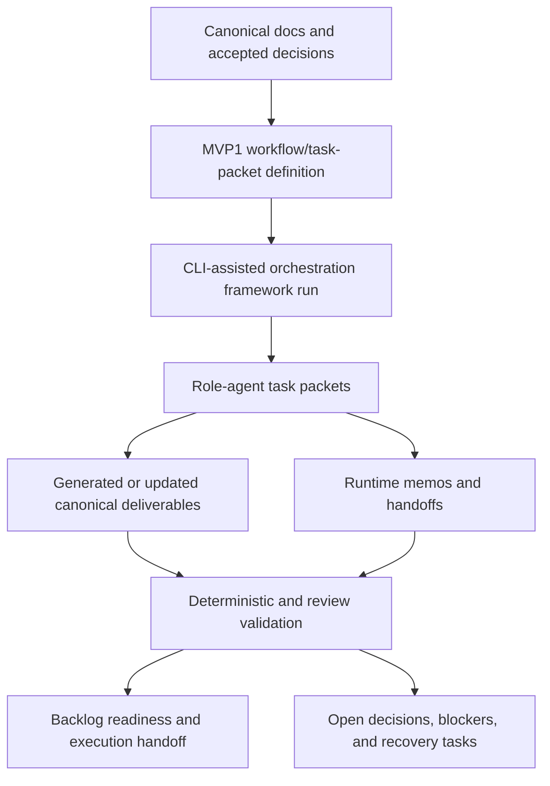

# MVP1 Platform Overview

- **Status**: draft MVP1 domain infrastructure
- **Owning workflow**: `synapse-concept-to-implementation`
- **Iteration**: `mvp1-iteration-01-domain-infrastructure`
- **Domain**: orchestration-framework / CLI-assisted concept-to-implementation
- **Last updated**: 2026-05-03

## Purpose

This document defines the MVP1 platform domain that later MVP1 iterations should
treat as their operating boundary. MVP1 is not a runtime-backed Synapse product
slice. It is a CLI-assisted concept-to-implementation pipeline that uses the
existing orchestration framework, canonical documentation, workflow/task packets,
agent memos, and deterministic validation scope to move one initiative from
concept refinement toward implementation handoff.

## Source register

| Source | How this overview uses it |
| --- | --- |
| `docs/refinement/iteration-inputs/mvp1-iteration-01-domain-infrastructure.md` | Iteration goal, required deliverables, and MVP1 scope boundaries. |
| `docs/architecture/ARCHITECTURE.md` | Domain-agnostic architecture principles, canonical truth rule, workflow/task/persona/knowledge/event concepts, and open decisions. |
| `docs/architecture/TECHNICAL_SPECIFICATIONS.md` | Technology-neutral component specifications, task dispatch constraints, conceptual records, event families, and non-functional expectations. |
| `docs/architecture/DECISIONS.md` | Accepted MVP1 decisions ADR-0011 through ADR-0014 and open architecture decisions. |
| `docs/planning/EXECUTION_ORCHESTRATION.md` | MVP1 sequence, G1/G2 gates, recovery paths, and deferred work. |
| `docs/planning/CONCURRENCY_ANALYSIS.md` | Safe parallelism, unsafe sequencing, artifact ownership, and source immutability rules. |
| `docs/work_items/INDEX.md` | MVP1 epic/story map and readiness policy. |
| `docs/work_items/DEPENDENCY_MAP.md` | Epic dependencies, blockers, gate alignment, and recommended implementation order. |
| `docs/standards/AI_AGENT_STANDARDS.md` | Agent role boundaries, evidence discipline, task-packet inputs, completion signals, and handoff expectations. |

## MVP1 platform thesis

MVP1 proves Synapse's concept-to-implementation operating model before committing
to product runtime infrastructure. The platform for this iteration is the
repository-centered orchestration system:

- canonical `docs/` artifacts are the implementation contract;
- `orchestration-framework/cli.py` and orchestration configuration provide the
  CLI-assisted execution model;
- workflow/task packets define bounded role-agent work;
- `.orchestration/runtime/agent-sync/` memos coordinate handoffs during runs;
- deterministic validators check the narrow artifact and signal rules accepted
  for MVP1; and
- the orchestration framework itself is the first internal domain/initiative.

This keeps MVP1 grounded in accepted decisions without selecting future storage,
event transport, runtime, tenancy, UI, provider, or legacy-adapter technology.

## In scope for MVP1

| Area | MVP1 scope |
| --- | --- |
| Delivery mode | CLI-assisted orchestration using the existing orchestration framework. |
| First domain | The orchestration framework and its concept-to-implementation workflow. |
| Canonical truth | Markdown-first canonical docs under `docs/`; raw and research inputs remain immutable sources. |
| Workflow model | Phases, iterations, roles, dependencies, source references, deliverables, completion criteria, and launch gates. |
| Task packets | Role-scoped packets with canonical sources, prohibited edits, dependencies, validation expectations, and handoff audience. |
| Coordination | Runtime memos and ready-to-consume handoffs for multi-agent work. |
| Validation | Required files, required sections/headings, PRD/FR trace markers where applicable, `E##` and `US-E##-###` ID format, prohibited `raw/`/`research/` mutation, and completion-signal format. |
| Backlog readiness | E01 through E05 refinement, dependency gates, readiness labels, and implementation handoff sequencing. |

## Out of scope or deferred

| Area | MVP1 disposition |
| --- | --- |
| Runtime-backed Synapse product behavior | Future. MVP1 documents contracts and handoff mechanics; it does not implement workflow runtime services. |
| Visual workflow designer UI | Future. Workflow authoring is Markdown/CLI-assisted for MVP1. |
| Concrete storage, event transport, schema registry, tenancy, provider, or deployment choices | Open. These remain architecture decisions until requirements and constraints stabilize. |
| Full hybrid event bus implementation | Future/open. MVP1 may reference event-family concepts but does not select or build transport. |
| Persona registry implementation | Future. MVP1 uses role instructions and task packets, not a product persona registry. |
| Knowledge retrieval or SME grounding store | Future/open. MVP1 uses canonical docs as grounding inputs. |
| Human approval automation | Future. MVP1 records review gates and handoffs, not approval runtime behavior. |
| Legacy bridge adapters | Future/open. No legacy system, corpus, adapter set, or compliance posture is selected for MVP1. |

## Domain operating model

## MVP1 dependency posture

MVP1 work follows the sequence established in the work-item index and dependency
map:

1. **E01 Canonical Documentation Foundation** establishes canonical paths,
   uncertainty labels, source immutability, open questions, and quality criteria.
2. **E02 Workflow Definition and Task-Packet Model** defines CLI-assisted phases,
   roles, inputs, deliverables, completion criteria, and coordination rules.
3. **E04 Backlog Generation and Readiness Gates** may refine in controlled
   parallel with late E02 work when write targets and metadata ownership are
   explicit.
4. **E03 Deterministic Validation and Completion Signals** depends on stable E02
   contracts.
5. **E05 Orchestration Execution Handoff** packages accepted E02-E04 outputs,
   recovery paths, unresolved blockers, and launch order.

Unsafe sequencing includes starting validation before workflow/task-packet
fields exist, packaging handoff before E02-E04 validate, or making
implementation-specific stack claims before open architecture decisions are
resolved.

## Assumptions

- CLI-assisted orchestration is sufficient for MVP1 foundation work before a
  runtime-backed Synapse product slice is designed.
- The orchestration framework is an adequate first internal domain for workflow
  and task-packet refinement.
- Markdown-first metadata is sufficient until validators demonstrate a concrete
  need for machine-readable schema extraction.
- Human review remains responsible for accepting canonical docs, readiness gates,
  and future behavior-affecting changes.

## Open decisions and future gates

| Decision or gate | MVP1 treatment |
| --- | --- |
| Runtime and persistence mechanism | Open; defer beyond MVP1 unless converted into a bounded spike. |
| Event transport and schema registry | Open; follow event-contract standards conceptually without selecting transport. |
| Tenancy, access control, compliance, retention | Open; do not make implementation claims in MVP1 deliverables. |
| Visual workflow representation | Open; MVP1 uses Markdown/CLI workflow definitions. |
| Source inventory and SME grounding model | MVP2 gate after MVP1 task-packet conventions stabilize. |
| Monitoring, approval automation, feedback promotion | MVP3 gate after workflow states, completion signals, and event families stabilize. |
| Legacy adapter set and transition corpus | MVP4 gate after a concrete legacy scenario is validated. |

## Readiness criteria for downstream MVP1 work

Downstream MVP1 deliverables can consume this overview when they:

- preserve the CLI-assisted orchestration boundary;
- cite canonical `docs/` sources rather than raw or research files as the
  implementation contract;
- keep future product/runtime/UI/storage/event/provider/legacy choices marked as
  future or open;
- define disjoint write targets or an explicit coordination contract; and
- record validation performed, validation not performed, assumptions, open
  decisions, and completion signal status.
