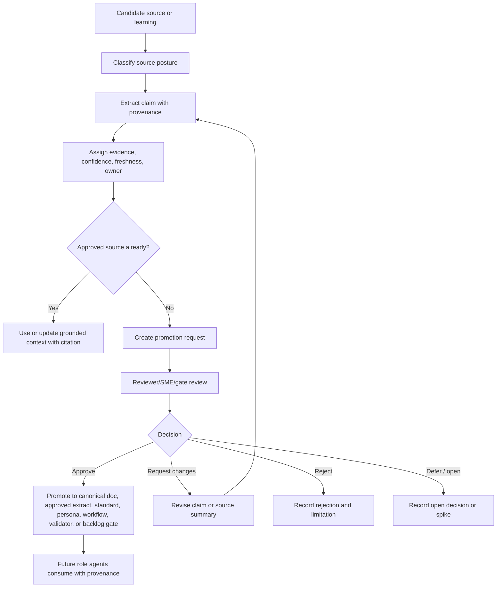

# MVP2 Knowledge Grounding Model

- **Status**: draft MVP2 source-grounding foundation
- **Owning workflow**: `synapse-concept-to-implementation`
- **Iteration**: `mvp2-iteration-01-source-grounding`
- **Domain**: Knowledge grounding for repeatable SME agents
- **Last updated**: 2026-05-03

## Purpose

This model defines how MVP2 knowledge becomes safe for role agents, personas,
workflow templates, and backlog gates to consume. It describes source posture,
provenance, evidence, confidence, freshness, review, promotion, consumption, and
open-decision contracts without choosing storage, retrieval, embedding,
connector, tenancy, compliance, access-control, provider, or runtime technology.

## Source basis

| Source | How this model uses it |
| --- | --- |
| `docs/MVP2/Knowledge/SourceInventory.md` | Source classes, priorities, approved vs operational source posture, ownership, freshness, and confidence labels. |
| `docs/refinement/iteration-inputs/mvp2-iteration-01-source-grounding.md` | MVP2 grounding goal and explicit future-scope exclusions. |
| `docs/requirements/PRODUCT_REQUIREMENTS.md` | Product requirements for canonical truth, provenance, SME grounding, reusable personas, and feedback loops. |
| `docs/requirements/FUNCTIONAL_REQUIREMENTS.md` | FR-002, FR-004, FR-009, FR-010, FR-016, FR-017, FR-021, and FR-022 for evidence, grounding, persona templates, learning promotion, and implementation-agnostic execution. |
| `docs/architecture/ARCHITECTURE.md` | Knowledge and grounding layer, canonical knowledge repository concept, SME knowledge models, knowledge loop, and contracts-before-stack principle. |
| `docs/architecture/TECHNICAL_SPECIFICATIONS.md` | Conceptual `KnowledgeAsset` fields, required capabilities for evidence class, confidence, freshness, applicability, and open storage/retrieval choices. |
| `docs/architecture/DECISIONS.md` | Accepted decisions for immutable sources, knowledge loop, SME grounding, and stack-choice deferral; OAD-0005 for knowledge storage/retrieval as open. |
| `docs/MVP1/Platform/DataModel.md` | Logical record, decision/open-question, validation, readiness, runtime reference, and retention/audit posture. |
| `docs/MVP1/Platform/Integrations.md` | Handoff, validation, telemetry/log reference, recovery, and human review contracts. |
| `docs/MVP1/Platform/TestingStrategy.md` | Review-only evidence sufficiency, reusable behavior review, source immutability, and future-scope guard. |
| `docs/MVP1/Platform/AcceptanceCriteria.md` | Runtime finding promotion, source immutability, handoff, traceability, and technology-neutral acceptance criteria. |
| `docs/MVP1/Platform/OperationalRunbook.md` | Operational artifact handling, runtime promotion, source immutability incidents, and recovery records. |
| `docs/work_items/INDEX.md` | E06 source inventory and grounding model dependency on E01/E02 and downstream unlock of E07/E08. |
| `docs/work_items/DEPENDENCY_MAP.md` | G3 knowledge/persona gate and blocker B-DM-007 for source type and grounding priority. |
| `docs/standards/AI_AGENT_STANDARDS.md` | Evidence classes, task-packet source expectations, output quality, completion signals, and governance for behavior-affecting changes. |
| `docs/standards/EVENT_CONTRACT_STANDARDS.md` | Conceptual `knowledge_asset`, `persona`, `workflow_template`, validation, telemetry, and approval event families without implementation commitment. |

## Grounding principles

1. **Grounding is a contract, not a retrieval design**: This model defines what
   context is safe to use and how it must be cited. It does not define where
   knowledge is stored, how it is indexed, or how agents retrieve it.
2. **Approved sources outrank operational evidence**: Canonical docs, reviewed
   decisions, standards, work items, and reviewed configuration can directly
   ground claims. Runtime, raw, research, and external material must be promoted
   before reuse as durable knowledge.
3. **Evidence class must survive transformation**: Summaries, persona guidance,
   workflow templates, and backlog gates must keep `source-backed`, `inferred`,
   `assumed`, and `open` claims distinguishable.
4. **Confidence and freshness are review signals**: Confidence and freshness
   guide whether a role agent can rely on a claim, whether review is needed, or
   whether a decision/spike must happen first.
5. **Promotion changes future behavior**: Any source promotion that affects
   future role agents, personas, workflow templates, standards, validators, or
   backlog gates requires attribution and review.
6. **Open decisions block implementation claims**: Missing source owner,
   compliance posture, retention, access, tenancy, connector, provider, storage,
   retrieval, embedding, or runtime decisions must be recorded as open rather
   than filled in by assumption.

## Conceptual grounding records

The following records are logical contracts. They may be represented in
Markdown, configuration, task packets, handoffs, standards, or future structured
forms, but this model does not select a physical schema.

| Record | Purpose | Minimum fields |
| --- | --- | --- |
| `SourceReference` | Identifies the source behind a claim or instruction. | Source class, path/ID, source status, owner role, source date or last-reviewed marker when known. |
| `GroundedClaim` | A specific reusable fact, rule, constraint, assumption, or open question. | Claim text, source references, evidence class, confidence, freshness, applicability, limitations. |
| `KnowledgeAsset` | A reusable knowledge unit such as requirement summary, decision summary, SME extract, runbook guidance, lesson learned, or persona instruction. | Asset ID/path, kind, source references, claims, owner, reviewer, confidence, freshness, promotion state, downstream consumers. |
| `PromotionRequest` | Proposal to turn operational, seed, SME, or external evidence into approved knowledge. | Candidate source, proposed claim, target artifact, evidence class, confidence rationale, reviewer role, open decisions, promotion outcome. |
| `GroundingContext` | The bounded context supplied to a role agent or persona for a task. | Task/workflow IDs, source priority list, required approved sources, allowed operational references, exclusions, confidence/freshness requirements, handoff expectations. |
| `ReviewDecision` | Human or SME judgment that approves, rejects, requests changes, defers, or supersedes knowledge. | Reviewer role, evidence reviewed, decision, rationale, affected assets, limits of approval, recovery or follow-up. |
| `LearningSignal` | Repeated pattern from workflow execution that may update reusable behavior. | Signal summary, runtime references, recurrence or impact, candidate promotion target, owner, review need. |

## Knowledge asset kinds

| Kind | Examples | Default owner | Default promotion target |
| --- | --- | --- | --- |
| Requirement knowledge | PRD/FR summaries, open-question mappings, validation needs | Product owner / requirements owner | Requirements docs or backlog gates. |
| Architecture knowledge | Component boundaries, data contracts, accepted ADRs, OAD blockers | Architect / data architect | Architecture docs, technical specifications, decision log. |
| Workflow knowledge | Phase/iteration contracts, task-packet rules, handoff shape, completion signals | Orchestrator / configuration owner | Workflow config, task-packet guidance, runbook. |
| Persona knowledge | Role responsibilities, evidence discipline, quality standards, prohibited actions | Standards curator / role owner | Persona configuration or persona template docs. |
| Operational knowledge | Validation gaps, runtime limitations, recovery patterns, incident notes | SRE / integrator / validator owner | Runbook, testing strategy, standards, backlog gates. |
| SME/domain knowledge | Reviewed SME explanation, domain glossary, domain constraints, applicability notes | SME / domain reviewer | Approved extract, domain configuration, persona guidance. |
| Learning knowledge | Recurring defect, successful recovery pattern, prompt/task improvement | Standards curator / orchestrator | Standards, templates, validators, personas, workflow templates, work items. |

## Evidence, confidence, and freshness rules

### Evidence classes

Use the existing AI agent standards:

| Evidence class | Use in grounding | Consumption rule |
| --- | --- | --- |
| `source-backed` | Directly supported by approved source or approved extract. | May be used as grounding within source scope and freshness limits. |
| `inferred` | Reasonably derived from approved sources but not directly stated. | May guide drafts; material implementation or behavior claims require caveat or review. |
| `assumed` | Needed to proceed but not validated. | Must be marked as assumption and linked to validation need or open question. |
| `open` | Unknown or requiring product, architecture, governance, or stakeholder decision. | Must not ground committed behavior; route to decision, reviewer, or spike. |

### Confidence labels

| Confidence | Grounding rule | Required action |
| --- | --- | --- |
| High | Approved source, clear applicability, current/recent freshness, no conflicting open decision. | Cite source; safe for role-agent grounding within stated scope. |
| Medium | Approved source with interpretation, older freshness, partial reviewer coverage, or bounded assumption. | Cite source and caveat; reviewer may be required for reusable persona/template changes. |
| Low | Operational, seed, stale-risk, or future source context that has not been promoted. | Use only for discovery, draft hypotheses, or promotion proposals. |
| Blocked | Claim depends on unresolved source, owner, governance, compliance, implementation, or product decision. | Do not consume as grounding; record open decision or recovery owner. |

### Freshness labels

| Freshness | Grounding rule | Required action |
| --- | --- | --- |
| `current` | Reviewed for this iteration or explicitly still valid. | Safe to use within scope. |
| `recent` | Accepted in prior iteration with no known newer conflict. | Confirm no superseding decision before high-confidence reuse. |
| `stale-risk` | May be outdated because newer decisions, domain changes, or review gaps exist. | Require owner/reviewer confirmation before grounding future behavior. |
| `superseded` | Replaced by newer accepted source. | Use only for history; cite superseding source. |
| `unknown` | Review date, owner, or applicability is unclear. | Treat as low confidence or open until clarified. |

## Approved vs operational source consumption

| Source posture | Role-agent consumption | Persona/template consumption | Required handoff language |
| --- | --- | --- | --- |
| Approved source | May be cited directly for task output and decision-grade artifacts. | May be incorporated into reusable persona guidance if source scope matches role. | Source path/ID, evidence class, confidence/freshness, open decisions. |
| Approved extract | May be cited directly within extract scope. | May be incorporated when reviewer and limitations are recorded. | Extract path/ID, original source reference if available, reviewer, limits. |
| Operational source | May inform recovery or draft promotion proposal; not durable truth. | Must not change reusable persona behavior until promoted. | Runtime reference, durability `operational-only`, material summary, promotion target. |
| Seed source | May support source archaeology or validation; not implementation truth. | Must not be embedded directly unless promoted into approved extract. | Read-only source path, promoted claim target, evidence caveat. |
| Future candidate source | Discovery only. | Not consumable by reusable persona/template work. | Open owner/access/compliance/freshness/promotion decisions. |

## Promotion lifecycle

### Promotion states

| State | Meaning | Downstream use |
| --- | --- | --- |
| `candidate` | Source or learning is identified but not yet classified. | Discovery only. |
| `proposed` | Claim and target promotion path are documented. | May be reviewed; not durable grounding. |
| `review-needed` | Human, SME, standards, product, architecture, or governance review is required. | Blocks reusable behavior changes. |
| `approved` | Reviewer accepted claim, scope, confidence, freshness, and target. | May ground future agents within limits. |
| `operational-only` | Useful for traceability/recovery but not durable knowledge. | Do not embed in persona/template behavior. |
| `superseded` | Replaced by newer approved source or decision. | Historical reference only. |
| `rejected` | Reviewer rejected source or claim for grounding. | Do not consume except as limitation/risk context. |

### Promotion targets

| Target | When to use | Reviewer expectation |
| --- | --- | --- |
| Canonical docs | Claim affects product, functional, architecture, planning, operations, or work-item truth. | Relevant document owner and integrator review. |
| Approved extract | Source is raw, runtime, SME, or external but only a bounded summary should become reusable. | Source owner plus domain/SME or integrator review. |
| Standards | Learning affects all agents, evidence discipline, validation, events, documentation, or reusable quality gates. | Standards curator and affected owner review. |
| Persona guidance | Learning changes role responsibilities, prohibited actions, evidence rules, or output standards. | Role owner, standards curator, and integrator review. |
| Workflow template | Learning changes phase/iteration/task-packet structure, dependencies, or handoff shape. | Orchestrator/configuration owner review. |
| Validator or quality gate | Learning reveals repeatable objective check or review-only gate. | Validator owner/QA plus reviewer role. |
| Backlog gate or work item | Learning creates new implementation dependency, spike, risk, or readiness blocker. | Backlog owner/dependency analyst review. |

## Consumption contracts for role agents and personas

### Task-packet source contract

Every MVP2 grounding-aware task packet or persona instantiation should identify:

| Field | Requirement |
| --- | --- |
| `required_approved_sources` | P0/P1 sources that must be read or cited. |
| `allowed_operational_references` | Runtime or log references allowed only for traceability, recovery, or promotion proposals. |
| `prohibited_sources` | Sources that must not be used for direct grounding, including raw/research or future external sources unless the task explicitly scopes source review. |
| `evidence_expectations` | Required evidence classes and where assumptions/open questions must be recorded. |
| `confidence_threshold` | Minimum confidence for committed claims; blocked/low confidence claims become assumptions, validation needs, or open questions. |
| `freshness_expectation` | Whether current/recent sources are required and how stale-risk/unknown sources should be handled. |
| `promotion_scope` | Whether the agent may propose, draft, or directly update a promotion target. |
| `handoff_requirements` | Changed artifacts, source summary, validation not performed, open decisions, promotion recommendations, and prohibited-edit confirmation. |

### Role-specific consumption expectations

| Consumer | Must consume | Must produce or preserve |
| --- | --- | --- |
| Orchestrator | Source inventory, workflow config, input packets, dependency gates, accepted decisions. | Grounding context in task packets; blocked/open decisions for missing sources; recovery routing for partial or stale context. |
| Specialist role agent | Required approved sources, task packet boundaries, standards, accepted decisions. | Deliverables with cited evidence, confidence/freshness caveats, open questions, validation status, and completion signal. |
| Data architect | Source inventory, conceptual records, provenance/freshness/confidence rules. | Technology-neutral grounding contracts, data-quality rules, source ownership, and open implementation decisions. |
| Standards curator | Evidence and handoff standards, recurring learning signals, source-promotion gaps. | Reusable standards updates or promotion rules after review; no unreviewed behavior changes. |
| Product owner / requirements role | Requirements sources, user value, open questions, validation needs. | Product-grounded claims and backlog gates that preserve assumption/open status. |
| Architect / tech lead | Architecture sources, ADR/OADs, integration boundaries, future-scope guards. | Architecture-grounded constraints and open decisions without stack commitments. |
| Persona/template owner | Approved role, evidence, source, and quality guidance. | Persona guidance with provenance, version/change rationale, confidence, and review status. |
| Integrator / reviewer | Handoffs, validation status, source provenance, promotion requests, runtime summaries. | Review decisions, accepted limitations, recovery owners, and downstream-safe consumption notes. |

### Persona grounding rules

Persona or role-template guidance may include knowledge only when:

1. The claim comes from an approved source or approved extract.
2. The persona guidance records source path/ID or promotion reference.
3. Confidence is high or medium; low confidence remains a caveat or discovery
   prompt, not a role instruction.
4. Freshness is current or recent, or stale-risk has reviewer confirmation.
5. Behavior-affecting changes have reviewer attribution and rationale.
6. Open decisions remain explicit prohibitions or escalation instructions.

Persona guidance must not:

- embed raw/research, runtime, or external-source claims directly without
  promotion;
- imply a storage, retrieval, embedding, connector, tenancy, compliance,
  provider, retention, deletion, or access-control implementation;
- remove source caveats when transforming a claim into an instruction;
- silently override task-packet sources, deliverables, prohibited edits, or
  completion criteria.

## Grounding quality gates

| Gate | Ready condition | Blocks readiness when |
| --- | --- | --- |
| Source posture gate | Every grounding source is approved, approved extract, operational, seed, or future candidate. | Source status is missing or operational/seed evidence is treated as approved. |
| Provenance gate | Grounded claims carry source path/ID, evidence class, confidence, freshness, owner, applicability, and limitations. | Claims cannot be traced or open decisions are dropped. |
| Confidence gate | Committed claims meet high/medium confidence with caveats; low/blocked claims are assumptions/open questions. | Low confidence is used as committed role or product behavior. |
| Freshness gate | Current/recent sources are used, or stale-risk/unknown sources have owner review. | Stale or unknown sources drive reusable behavior without review. |
| Promotion gate | Runtime, raw, SME, or external evidence is reviewed before becoming approved knowledge. | Material runtime/raw/external findings bypass promotion. |
| Persona behavior gate | Persona/template changes record source, reviewer, rationale, and limits. | Persona behavior changes without attribution or review. |
| Future-scope gate | Technology and governance implementation choices remain open/future. | Grounding model chooses storage, retrieval, embeddings, connector, tenancy, compliance, access-control, retention, provider, or runtime. |

## Runtime evidence and learning promotion

Runtime evidence may create a `LearningSignal` when it identifies:

- repeated task-packet defects;
- recurring validation gaps;
- token-budget or partial-completion patterns;
- blocked approvals or missing reviewer roles;
- stale source or source-drift problems;
- repeated evidence-classification mistakes;
- useful recovery patterns;
- persona instruction ambiguity;
- workflow/template gaps;
- backlog readiness blockers.

Learning signals must be routed to an owner and target:

| Learning target | Owner | Example source |
| --- | --- | --- |
| Standards update | Standards curator | Repeated agents omit confidence/freshness caveats. |
| Persona update | Role owner / standards curator | A role repeatedly oversteps source authority. |
| Workflow template update | Orchestrator / configuration owner | Task packets repeatedly omit allowed operational references. |
| Validator/check update | Validator owner / QA lead | Required provenance fields are frequently missing. |
| Backlog gate | Backlog owner / dependency analyst | E06 cannot proceed without named source owner decision. |
| Canonical doc update | Relevant doc owner / integrator | Runtime handoff reveals accepted MVP1 limitation not captured in docs. |

Runtime evidence remains operational-only until the learning is promoted through
one of these targets with review.

## Open decisions

| ID | Decision needed | Current MVP2 handling |
| --- | --- | --- |
| OQ-GM-001 | What concrete storage, indexing, retrieval, search, embedding, or knowledge-service technology should implement grounding later? | Future/open; this model defines logical contracts only. |
| OQ-GM-002 | Which source connectors, crawlers, sync jobs, or external systems should be supported first? | Future/open; treat external sources as candidates until source ownership, access, and governance are accepted. |
| OQ-GM-003 | What tenancy, access-control, compliance, sensitive-data, retention, deletion, and audit policies apply to knowledge assets? | Governance blocker for future implementation; keep conceptual provenance/freshness only. |
| OQ-GM-004 | Who are named accountable reviewers for source promotion, SME validation, persona behavior changes, and knowledge freshness review? | Use role-based owners until named people or teams are accepted. |
| OQ-GM-005 | What freshness cadence or expiration thresholds should apply by source class and domain? | Use labels (`current`, `recent`, `stale-risk`, `superseded`, `unknown`) without automated expiration. |
| OQ-GM-006 | What persona composition/inheritance representation should consume grounded knowledge in MVP2/E07? | Grounding supplies source and behavior contracts; representation remains an E07/persona decision. |
| OQ-GM-007 | What runtime/log references must be retained or summarized after orchestration runs? | Summarize material findings into approved sources or handoff packages; retention remains open. |
| OQ-GM-008 | What external customer/domain or legacy corpus should test grounding beyond the orchestration-framework domain? | Future validation decision; no external corpus is selected. |

## Assumptions

- MVP2 can define source and grounding contracts before implementing a runtime
  knowledge store.
- MVP1 canonical docs, work items, standards, decisions, and orchestration
  configuration provide enough approved material to seed source classes.
- Role-based owners are acceptable placeholders until named accountable owners
  are assigned.
- Human review remains required for source promotion, confidence/freshness
  disputes, SME validation, and reusable behavior changes.
- Future runtime, storage, retrieval, connector, tenancy, compliance, access, and
  provider decisions will be made through later accepted architecture/governance
  records rather than this model.
