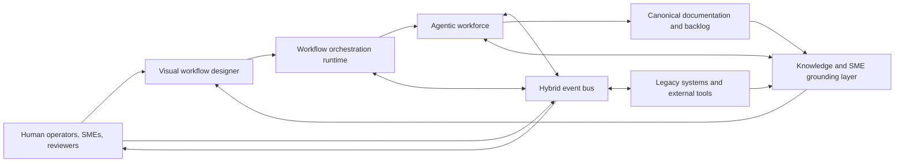
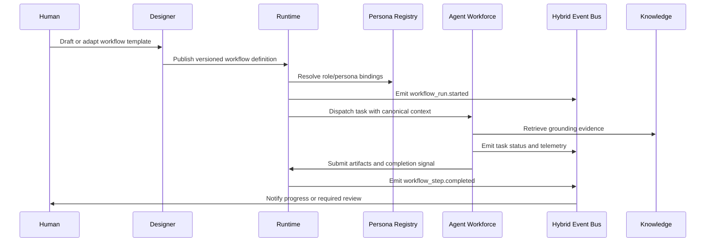
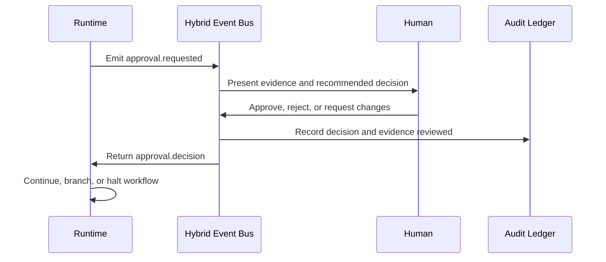
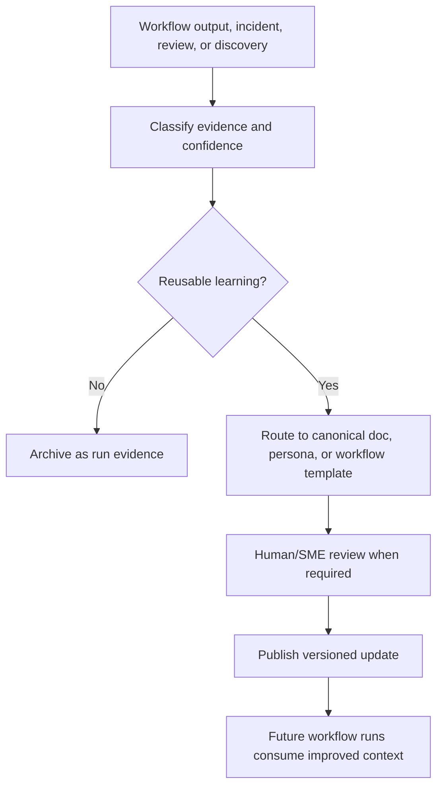

# Synapse Architecture

## Status

`canonical draft`

## Purpose

This document defines the initial target architecture for Synapse as a
domain-agnostic operational substrate for agentic workforces. It promotes
source-backed concepts from the research and product brief into architecture
truth while preserving uncertainty as assumptions and open decisions.

## Source Basis

- `docs/refinement/iteration-inputs/concept-extraction.md`
- `research/Synapse_Initial_Chat_Summary.md`
- `research/CONCEPT_TO_IMPLEMENTATION_PLAYBOOK.md`
- `work_items/synapse-product-brief.md`
- `docs/standards/ENGINEERING_STANDARDS.md`
- `docs/standards/AI_AGENT_STANDARDS.md`
- `docs/standards/EVENT_CONTRACT_STANDARDS.md`

## Architecture Thesis

Synapse is an operational substrate that lets humans define work outcomes,
encode organizational knowledge, delegate execution to agentic coworkers, and
continuously improve the workforce through feedback. It is intentionally
domain-agnostic: the platform should support software delivery, operational
triage, knowledge extraction, performance review, discovery workflows, and other
repeatable expert processes without hard-coding one vertical.

The architecture is organized around seven source-backed capabilities:

1. **Visual workflow designer** - humans author, compose, and monitor workflows
   through a canvas-oriented interface that supports nested workflows and live
   operational visibility.
2. **Hybrid event bus** - workflow events, agent telemetry, approvals, and
   integration notifications flow through a contract-driven event layer that
   supports both asynchronous work and synchronous approval gates.
3. **Object-oriented persona management** - reusable agent personas are modeled
   with inheritance-like composition: base template, extended template, and
   task-specific instance.
4. **Knowledge loop** - completed work, feedback, incident learnings, and
   discovery outputs are published back into knowledge assets and persona
   templates so the system improves over time.
5. **Human-in-the-loop approvals** - humans remain accountable for policy,
   risk, scope, and release decisions through explicit approval checkpoints.
6. **Legacy bridge** - Synapse can stabilize legacy operational contexts while
   extracting requirements and knowledge that support transition to new systems.
7. **SME and tribal-knowledge grounding** - subject-matter expertise is
   captured from documentation, historical workflows, and human review so agents
   operate from grounded organizational context instead of unsupported prompts.

## Guiding Principles

- **Domain agnostic by design**: workflows, personas, events, and knowledge
  assets should be configurable for any expert work domain.
- **Canonical truth over raw notes**: raw and research inputs inform canonical
  docs, but implementation agents should cite canonical documentation as the
  contract.
- **Agents as coworkers, not opaque tools**: agent work should have role
  boundaries, evidence discipline, completion signals, and observable progress.
- **Feedback closes the loop**: telemetry and review outputs must produce
  updates to workflow templates, persona definitions, knowledge assets, or
  backlog decisions.
- **Contracts before stack choices**: interfaces, event ownership, state models,
  and approval semantics should be defined before selecting specific products or
  runtimes.

## System Context

## Logical Component Model

### 1. Experience Layer

**Visual workflow designer**

- Provides drag-and-drop authoring for workflows, nested workflows, approval
  gates, role assignments, and integration boundaries.
- Shows live execution status, pending human approvals, agent completion
  signals, and operational telemetry.
- Should expose workflow templates as versioned assets rather than one-off
  diagrams.

**Operator and reviewer console**

- Gives humans queues for approvals, escalations, exceptions, and quality
  reviews.
- Presents evidence, source links, risk labels, and recommended decisions.
- Supports the cultural goal of augmentation by keeping human accountability and
  agency visible.

### 2. Orchestration Layer

**Workflow definition service**

- Stores workflow templates, nested workflow references, role bindings,
  acceptance criteria, and completion rules.
- Separates workflow intent from runtime execution so templates can be reused
  across domains.

**Workflow execution runtime**

- Instantiates workflow runs from templates.
- Assigns work to specialist agents and tools.
- Tracks execution state, dependencies, retries, pauses, approvals, and
  completion.
- Emits lifecycle events to the hybrid event bus.

**Human approval coordinator**

- Models approval gates as first-class workflow steps.
- Blocks or routes execution when policy, risk, release, or SME review is
  required.
- Records approver identity, decision, timestamp, evidence reviewed, and
  resulting state transition.

### 3. Agent Workforce Layer

**Persona registry**

- Stores base personas, extended personas, and task-specific persona instances.
- Supports inheritance-like composition for prompt/persona reuse without
  duplicating role definitions.
- Tracks version lineage, intended domain, allowed tools, quality gates, and
  evidence requirements.

**Agent task dispatcher**

- Converts workflow steps into agent task cards or prompts.
- Assigns work according to role, domain, complexity, and dependency context.
- Captures completion signals such as `TASK_COMPLETE` and
  `TOKEN_BUDGET_LOW`, consistent with existing agent standards.

**Agent execution adapters**

- Integrate with agent runtimes, tools, or IDE automation without binding the
  architecture to a specific vendor.
- Enforce role boundaries and collect artifacts, logs, and telemetry.

### 4. Knowledge and Grounding Layer

**Canonical knowledge repository**

- Stores implementation-ready truth: requirements, architecture, planning,
  standards, work items, runbooks, and approved knowledge extracts.
- Keeps raw or research material out of the implementation contract until it is
  promoted through review.

**SME knowledge models**

- Represent domain expertise extracted from documentation, historical work,
  incident reviews, discovery sessions, and SME review.
- Ground agent behavior with explicit evidence and confidence labels.

**Knowledge-loop processor**

- Consumes workflow outputs, review feedback, incidents, and telemetry.
- Identifies reusable learnings and routes them to knowledge assets, workflow
  templates, or persona updates.
- Preserves the playbook invariant that feedback must change future execution or
  it does not count as learning.

### 5. Integration Layer

**Hybrid event bus**

- Carries workflow lifecycle events, agent status events, approval requests,
  approval decisions, telemetry, and integration notifications.
- Supports asynchronous event consumers and synchronous request/response
  approval semantics at workflow boundaries.
- Uses explicit event ownership, schema versioning, idempotency, retry, and
  dead-letter conventions.

**Legacy bridge**

- Connects Synapse workflows to legacy monoliths, operational systems, source
  repositories, documentation stores, ticketing systems, and communication
  tools.
- Supports transition-state use cases: stabilize current operations, extract
  requirements, and feed greenfield architecture work.
- Should isolate legacy-specific adapters from domain-agnostic workflow and
  persona models.

### 6. Governance and Observability Layer

**Audit and decision ledger**

- Records workflow definitions, run history, event history, approvals, persona
  versions, knowledge updates, and architecture decisions.
- Provides traceability from agent output back to workflow step, persona,
  source evidence, approval status, and canonical doc changes.

**Telemetry and quality analytics**

- Measures completion rates, approval cycle time, exception patterns, agent
  quality, template drift, and knowledge-loop effectiveness.
- Feeds the continuous improvement loop and highlights bottlenecks such as SME
  review queues or repeated token-budget failures.

## Primary Workflows

### Workflow Authoring and Execution

### Human Approval Gate

### Knowledge Loop

## Data and State Model

The architecture requires these conceptual records. Physical storage choices are
open.

- **WorkflowTemplate**: versioned workflow graph, nested workflow references,
  required roles, approval gates, expected artifacts, and completion criteria.
- **WorkflowRun**: runtime instance, input context, state, step history,
  assigned agents, approvals, and outputs.
- **PersonaDefinition**: base, extension, or instance persona with lineage,
  role boundaries, evidence rules, tool access, and quality standards.
- **TaskCard**: executable unit assigned to an agent or human, including
  canonical context, deliverables, completion signal contract, and dependencies.
- **KnowledgeAsset**: canonical documentation, SME extract, template guidance,
  lesson learned, or source-grounded knowledge record with confidence labels.
- **EventContract**: event name, owner, schema version, producer, consumers,
  retry policy, idempotency key, and retention/replay expectations.
- **ApprovalDecision**: approver, workflow step, decision, rationale, evidence
  reviewed, timestamp, and downstream state transition.
- **AuditRecord**: immutable trail tying workflow, persona, event, knowledge,
  artifact, and approval changes together.

## Integration Boundaries

- **Agent runtimes**: pluggable adapters; no specific model, IDE, or agent
  vendor is committed in this draft.
- **Knowledge stores**: may include document repositories, code repositories,
  artifact stores, ticket systems, or SME-curated knowledge bases.
- **Legacy systems**: connected through bounded adapters owned by the legacy
  bridge, not embedded into core workflow logic.
- **Communication and approval channels**: may include application UI,
  notifications, chat tools, or ticketing systems; final channel commitments are
  open.
- **Telemetry sinks**: metrics, logs, traces, and audit records must be emitted
  through explicit contracts; concrete observability platforms remain open.

## Assumptions

- Synapse will use existing orchestration-framework concepts as a reference
  model for workflows, role agents, completion signals, and feedback loops.
- Canonical documentation under `docs/` is the implementation contract; raw and
  research sources remain inputs, not direct runtime truth.
- Human approval gates are required for high-risk or policy-sensitive work even
  when low-risk workflow steps can run autonomously.
- Persona inheritance is a conceptual model for managing reusable agent behavior;
  the concrete representation is not yet decided.
- Legacy bridge use cases are important enough to shape integration boundaries,
  but no specific legacy system has been selected as MVP scope.

## Open Decisions

- Which MVP workflows and customer/user segments should be implemented first?
- What tenancy model is required: single organization, multi-tenant SaaS, or
  deploy-per-customer?
- What data classification, retention, compliance, and audit requirements apply?
- Which concrete event transport, workflow runtime, storage systems, and agent
  runtime integrations should be selected?
- How should SME knowledge be validated, scored, expired, and refreshed?
- What approval policies distinguish autonomous steps from mandatory human
  review?
- How will visual workflow templates be represented for versioning, diffing,
  testing, and promotion between environments?
