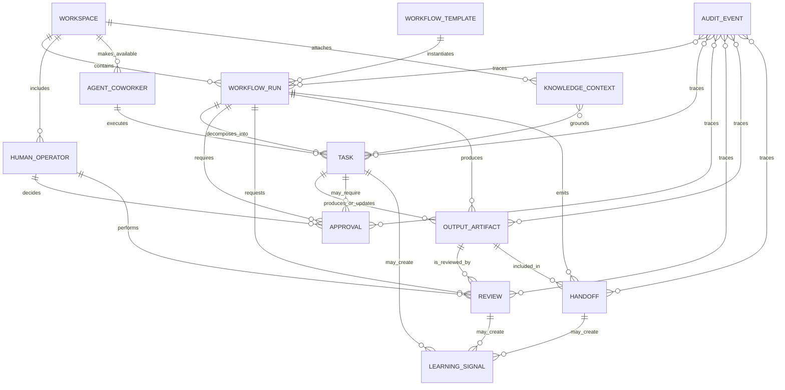

# Synapse MVP1 Runtime Contracts

- **Status**: draft product runtime contract
- **Product slice**: MVP1 AI coworker workspace for one approved expert workflow
- **Last updated**: 2026-05-03

## Purpose

This document defines product-facing runtime contracts for the Synapse MVP1 AI
coworker workspace. It specifies the logical objects, states, identifiers,
relationships, validation and governance rules, audit concepts, and open
implementation decisions needed for a human operator to define a destination,
select one approved workflow, attach governed knowledge, dispatch agent
coworkers, monitor progress, review outputs, approve gates, hand off results,
and capture learnings.

These are product contracts, not storage schemas, provider APIs, deployment
choices, or tenancy decisions. The MVP1 platform docs are treated as prototype
evidence for task packets, handoffs, validation, review gates, runtime
references, recovery, and learning promotion. Synapse product runtime contracts
must remain tool-agnostic and must not expose `cursor_orchestrator`,
`.orchestration/runtime/`, Cursor rules, generated task cards, or current YAML
workflows as customer-facing product entities.

## Source basis

| Source | Runtime-contract use |
| --- | --- |
| `docs/refinement/iteration-inputs/product-mvp1-ai-coworker-workspace.md` | Defines MVP1 as an AI coworker workspace for one approved expert workflow and separates Synapse product from scaffolding. |
| `docs/product/MVP_STRATEGY.md` | Defines MVP1 capabilities: workflow setup, role/persona selection, knowledge attachment, task dispatch, human review gates, output/handoff review, and learning capture. |
| `docs/product/SYNAPSE_PRODUCT_REQUIREMENTS.md` | Provides product requirements for governed knowledge, human accountability, workflow coordination, review checkpoints, and learning loops. |
| `docs/product/PRODUCT_CAPABILITY_MAP.md` | Maps MVP1 capabilities to workflow authoring, task packet generation, governance, monitoring, and learning dependencies. |
| `docs/architecture/ARCHITECTURE.md` | Provides domain-agnostic architecture concepts: workflow templates, runs, personas, tasks, approvals, audit records, knowledge, and feedback loops. |
| `docs/MVP2/Knowledge/GroundingModel.md` | Supplies grounding records, evidence classes, confidence/freshness labels, promotion lifecycle, and learning-signal semantics. |
| `docs/standards/KNOWLEDGE_GROUNDING_STANDARDS.md` | Defines source promotion, provenance, review, approved-vs-operational handling, and governance gates for knowledge used by agents. |
| `docs/MVP1/Platform/*` | Prototype evidence for logical identifiers, states, task packets, validation results, human review, telemetry references, recovery, source immutability, and handoff expectations. |

## Scope and non-commitments

### In scope

- Logical runtime contracts for the first Synapse product workspace.
- States and allowed transitions needed to coordinate human and agent work.
- Stable identifier conventions for cross-reference and audit.
- Relationships among workflow, run, task, agent, human, knowledge, approval,
  review, artifact, learning, audit, and handoff records.
- Validation, governance, source-grounding, human accountability, and audit
  rules.
- Open implementation decisions that must be resolved later.

### Out of scope

This contract intentionally does not choose or imply:

- physical storage, database schema, indexing, search, or retrieval technology;
- agent runtime, model, provider, IDE, prompt-service, or tool integration;
- API protocol, event transport, schema registry, telemetry backend, or UI
  framework;
- tenancy, deployment, access-control, sensitive-data, compliance, retention,
  deletion, or billing model;
- visual workflow graph format, template publication mechanism, or runtime
  scheduler implementation;
- legacy adapter set, connector model, or external system integration.

## Runtime principles

1. **Human-owned destination**: a `HumanOperator` remains accountable for the
   workspace goal, constraints, risk acceptance, approvals, and final handoff.
2. **Workflow before execution**: a `WorkflowRun` can start only from an
   approved `WorkflowTemplate` version and bounded input context.
3. **Agents as coworkers**: an `AgentCoworker` has a role, boundaries,
   grounding context, task assignment, evidence expectations, and completion
   signal.
4. **Grounded claims over raw context**: a `KnowledgeContext` can directly ground
   work only through approved sources or approved extracts; operational evidence
   requires promotion before reusable reliance.
5. **Review gates preserve trust**: `Approval` and `Review` records distinguish
   human judgment from deterministic validation.
6. **Outputs carry provenance**: an `OutputArtifact` must link to producing
   tasks, source evidence, validation status, reviews, and handoff state.
7. **Learning changes future behavior only after review**: a `LearningSignal`
   may propose changes to knowledge, templates, personas, validators, backlog
   gates, or standards, but reusable behavior changes require promotion review.
8. **Auditability is conceptual and mandatory**: material state transitions,
   decisions, approvals, reviews, outputs, and learning promotions create
   `AuditEvent` records or equivalent audit trail entries.

## Contract catalog

| Contract | Product purpose | Primary owner |
| --- | --- | --- |
| `Workspace` | Bounded operator workspace for one approved workflow run and its context. | Human operator |
| `WorkflowTemplate` | Reusable expert workflow definition. | Workflow/template owner |
| `WorkflowRun` | Runtime instance of a workflow template in a workspace. | Human operator / run owner |
| `HumanOperator` | Accountable human actor who starts, monitors, reviews, approves, and hands off work. | Organization/product role |
| `AgentCoworker` | Role-scoped AI coworker assigned to tasks under boundaries and grounding rules. | Agent/persona owner |
| `KnowledgeContext` | Approved bounded knowledge packet supplied to workflow runs and tasks. | Knowledge/context owner |
| `Task` | Executable unit of human or agent work. | Task owner |
| `Approval` | Human gate that authorizes, blocks, defers, or redirects execution. | Approval gate owner |
| `Review` | Human or SME assessment of quality, evidence, risk, artifact readiness, or reusable learning. | Reviewer role |
| `OutputArtifact` | Produced or updated work product intended for review, handoff, or future reuse. | Artifact owner |
| `LearningSignal` | Candidate lesson from runtime, review, validation, or output patterns. | Learning owner |
| `AuditEvent` | Traceable record of a material runtime fact, state change, decision, or governance action. | Audit/governance owner |
| `Handoff` | Transfer package that states what can proceed, what is blocked, evidence, and follow-up. | Producing owner / receiving owner |

## Identifier conventions

Identifiers must be stable enough for product UX, cross-reference, validation,
and audit. They are not physical primary-key commitments.

| Contract | Identifier convention | Uniqueness scope |
| --- | --- | --- |
| `Workspace` | `workspace_id` | Product workspace namespace |
| `WorkflowTemplate` | `workflow_template_id` plus `workflow_template_version` | Template catalog |
| `WorkflowRun` | `workflow_run_id` | Workspace |
| `HumanOperator` | `human_operator_id` or role-scoped operator reference | Workspace or organization boundary to be decided later |
| `AgentCoworker` | `agent_coworker_id` plus `persona_or_role_id` | Workspace/run |
| `KnowledgeContext` | `knowledge_context_id` plus optional `knowledge_context_version` | Workspace or knowledge catalog boundary to be decided later |
| `Task` | `task_id` | Workflow run |
| `Approval` | `approval_id` | Workflow run |
| `Review` | `review_id` | Target artifact/task/approval/run |
| `OutputArtifact` | `output_artifact_id` plus human-readable title/path/reference | Workspace/run |
| `LearningSignal` | `learning_signal_id` | Workspace/run or learning queue |
| `AuditEvent` | `audit_event_id` plus `correlation_id` | Audit trail |
| `Handoff` | `handoff_id` | Workflow run |

Correlation fields should include `workspace_id`, `workflow_template_id`,
`workflow_template_version`, `workflow_run_id`, `task_id`, `approval_id`,
`review_id`, `output_artifact_id`, `learning_signal_id`, and `handoff_id` when
applicable. A `correlation_id` groups related audit events across one operator
action, run transition, task dispatch, approval sequence, review sequence, or
handoff.

## State summary

| Contract | States |
| --- | --- |
| `Workspace` | `draft`, `ready`, `active`, `paused`, `blocked`, `completed`, `archived` |
| `WorkflowTemplate` | `draft`, `review-needed`, `approved`, `active`, `superseded`, `retired`, `rejected` |
| `WorkflowRun` | `planned`, `ready`, `running`, `paused`, `waiting-for-approval`, `waiting-for-review`, `blocked`, `partial-complete`, `completed`, `cancelled` |
| `HumanOperator` | `invited`, `active`, `unavailable`, `delegated`, `removed` |
| `AgentCoworker` | `available`, `assigned`, `working`, `waiting`, `blocked`, `submitted`, `released`, `disabled` |
| `KnowledgeContext` | `draft`, `review-needed`, `approved`, `attached`, `stale-risk`, `superseded`, `rejected` |
| `Task` | `draft`, `ready`, `assigned`, `in-progress`, `waiting-for-approval`, `waiting-for-review`, `blocked`, `partial-complete`, `complete`, `cancelled` |
| `Approval` | `requested`, `approved`, `rejected`, `request-changes`, `deferred`, `escalated`, `expired`, `not-applicable` |
| `Review` | `requested`, `in-review`, `approved`, `request-changes`, `rejected`, `deferred`, `escalated`, `not-applicable` |
| `OutputArtifact` | `targeted`, `draft`, `submitted`, `ready-for-review`, `needs-revision`, `accepted`, `handed-off`, `superseded`, `rejected` |
| `LearningSignal` | `candidate`, `proposed`, `review-needed`, `approved`, `operational-only`, `promoted`, `deferred`, `rejected`, `superseded` |
| `AuditEvent` | `recorded`, `linked`, `superseded`, `redacted-or-restricted` |
| `Handoff` | `draft`, `ready-to-consume`, `ready-to-merge`, `blocked`, `partial`, `accepted`, `superseded` |

## Runtime relationship model

## Contract definitions

### Workspace

**Definition**: A bounded product workspace where one human operator configures,
executes, monitors, reviews, and hands off one approved expert workflow run.

**Minimum fields**

| Field | Requirement |
| --- | --- |
| `workspace_id` | Stable workspace identifier. |
| `name` | Human-readable workspace name. |
| `destination` | Human-owned outcome or objective. |
| `scope_statement` | Included and excluded work. |
| `human_operator_ids` | Operators accountable for launch, monitoring, approval, and handoff. |
| `workflow_run_ids` | Runs contained by the workspace. MVP1 expects one primary run. |
| `knowledge_context_ids` | Approved context attached to the workspace. |
| `agent_coworker_ids` | Agent coworkers available for the run. |
| `governance_profile` | Logical review, approval, evidence, and source rules applicable to the workspace. |
| `status` | Current workspace state. |
| `open_decisions` | Product, governance, or implementation decisions that block or constrain execution. |

**Validation and governance rules**

- A workspace cannot move to `ready` until destination, scope, operator,
  workflow template, knowledge context, and initial governance gates are named.
- A workspace cannot move to `active` until its primary `WorkflowRun` is
  `ready` and required launch approvals are approved or explicitly not
  applicable.
- Workspace context must mark implementation-specific unknowns as open rather
  than treating them as accepted product behavior.
- If attached knowledge is `stale-risk`, `review-needed`, `rejected`, or
  `superseded`, tasks that depend on it are blocked or routed to review.

### WorkflowTemplate

**Definition**: A reusable expert workflow contract that describes the work
sequence, roles, task patterns, approval gates, review expectations, expected
outputs, completion rules, and learning routes for one approved workflow.

**Minimum fields**

| Field | Requirement |
| --- | --- |
| `workflow_template_id` | Stable template identifier. |
| `workflow_template_version` | Version or revision label. |
| `name` | Human-readable workflow name. |
| `purpose` | Expert outcome the template is designed to produce. |
| `allowed_workspace_scope` | Where this template applies and known limits. |
| `role_bindings` | Required human and agent roles. |
| `task_definitions` | Logical tasks or steps with dependencies and expected owners. |
| `approval_gates` | Required approvals and triggers. |
| `review_gates` | Required reviews and evidence expectations. |
| `expected_output_artifacts` | Artifact types or deliverables expected from runs. |
| `knowledge_requirements` | Required source posture, confidence, freshness, and exclusions. |
| `completion_criteria` | Conditions for run completion and handoff readiness. |
| `learning_targets` | Where recurring learnings may be promoted. |
| `status` | Template state. |

**Validation and governance rules**

- A `WorkflowRun` can be created only from an `approved` or `active` template.
- Behavior-affecting template changes require review and must create audit
  events with rationale and affected downstream behavior.
- Templates must define human accountability for launch, approvals, reviews,
  final acceptance, and learning promotion.
- Templates must not embed raw, research, operational, or external evidence as
  durable truth unless that evidence is promoted into approved knowledge or an
  approved extract.

### WorkflowRun

**Definition**: A runtime instance of a `WorkflowTemplate` inside a `Workspace`.
It carries inputs, assigned human and agent coworkers, task states, approvals,
reviews, outputs, learning signals, and handoffs.

**Minimum fields**

| Field | Requirement |
| --- | --- |
| `workflow_run_id` | Stable run identifier. |
| `workspace_id` | Parent workspace. |
| `workflow_template_id` / `workflow_template_version` | Template source. |
| `run_goal` | Specific run objective derived from workspace destination. |
| `input_summary` | Bounded summary of operator-provided context. |
| `knowledge_context_ids` | Attached approved contexts. |
| `human_operator_ids` | Accountable humans and reviewers. |
| `agent_coworker_ids` | Assigned agent coworkers. |
| `task_ids` | Tasks in the run. |
| `approval_ids` | Approval gates associated with the run. |
| `review_ids` | Review gates associated with the run. |
| `output_artifact_ids` | Outputs produced or updated. |
| `handoff_ids` | Handoffs created by the run. |
| `status` | Current run state. |
| `completion_signal` | `RUN_COMPLETE`, `RUN_BLOCKED`, `RUN_PARTIAL_COMPLETE`, or equivalent logical signal. |

**Validation and governance rules**

- A run cannot move to `ready` without an approved template, operator, required
  knowledge context, initial tasks, launch criteria, and known approval/review
  gates.
- A run moves to `waiting-for-approval` when an approval gate blocks further
  execution.
- A run moves to `waiting-for-review` when outputs or decisions require
  reviewer judgment before downstream reliance.
- A run moves to `partial-complete` only when useful output exists and remaining
  work, blockers, recovery owner, and downstream limits are recorded.
- A run moves to `completed` only when required tasks are complete or accepted as
  not applicable, approvals and reviews are resolved, required artifacts are
  accepted or handed off, and open blockers are either resolved or documented as
  accepted limitations.

### HumanOperator

**Definition**: A human actor accountable for destination setting, launch,
monitoring, risk acceptance, approval, review, escalation, final acceptance, and
handoff.

**Minimum fields**

| Field | Requirement |
| --- | --- |
| `human_operator_id` | Stable operator reference. |
| `display_name_or_role` | Human-readable role or name. |
| `operator_role` | Operator, reviewer, approver, SME, integrator, or recovery owner. |
| `accountabilities` | Decisions or gates the human owns. |
| `workspace_ids` | Workspaces where the human is active. |
| `availability_status` | Current state. |
| `delegation_target` | Replacement role or operator when delegated. |

**Validation and governance rules**

- Every workspace and run must have at least one active accountable
  `HumanOperator`.
- Review-only gates cannot be approved by an unnamed or unavailable reviewer.
- If an operator is `unavailable`, gates owned by that operator must be
  delegated, escalated, or blocked.
- Human decisions must capture evidence reviewed, rationale, downstream impact,
  and recovery action when not approved.

### AgentCoworker

**Definition**: A role-scoped AI coworker that executes assigned `Task` records
under bounded role guidance, allowed actions, grounding context, evidence rules,
and human review gates.

**Minimum fields**

| Field | Requirement |
| --- | --- |
| `agent_coworker_id` | Stable coworker identifier for the workspace or run. |
| `persona_or_role_id` | Role/persona reference. |
| `role_summary` | Human-readable coworker responsibility. |
| `allowed_task_types` | Tasks this coworker may execute. |
| `prohibited_actions` | Actions, sources, claims, or changes outside scope. |
| `knowledge_context_ids` | Contexts the coworker may consume. |
| `assigned_task_ids` | Current and historical assigned tasks. |
| `status` | Current coworker state. |
| `completion_signal_contract` | Allowed task completion signals. |

**Validation and governance rules**

- Agent coworkers cannot self-expand scope beyond assigned tasks, approved
  knowledge, allowed actions, and workflow role boundaries.
- Agent coworkers must preserve evidence class, confidence, freshness,
  assumptions, open questions, and validation status in outputs.
- Agent coworker completion must use one standard task signal:
  `TASK_COMPLETE`, `TOKEN_BUDGET_LOW`, `BLOCKED`, or `PARTIAL_COMPLETE`.
- Reusable persona or role behavior changes require review and cannot be
  inferred from one run without a promoted `LearningSignal`.

### KnowledgeContext

**Definition**: The bounded, governed source context supplied to a workspace,
workflow run, or task. It defines which knowledge can ground agent and human
decisions and which references are operational-only.

**Minimum fields**

| Field | Requirement |
| --- | --- |
| `knowledge_context_id` | Stable context identifier. |
| `knowledge_context_version` | Optional version or review label. |
| `source_references` | Approved sources, approved extracts, operational references, exclusions, and limits. |
| `evidence_expectations` | Required evidence classes and citation behavior. |
| `confidence_threshold` | Minimum confidence for committed claims. |
| `freshness_expectation` | Freshness labels required or accepted. |
| `owner_role` | Accountable knowledge owner. |
| `reviewer_role` | Reviewer for promotion or freshness disputes. |
| `promotion_state` | State aligned to grounding standards. |
| `status` | Context state. |

**Validation and governance rules**

- Approved sources and approved extracts may ground task output within their
  recorded scope, confidence, and freshness limits.
- Operational sources may support traceability, recovery, or promotion
  proposals; they must not ground reusable behavior until promoted.
- Low confidence, blocked, stale-risk, assumed, or open claims require caveat,
  review, or escalation before committed behavior.
- Knowledge context must not choose retrieval, storage, embedding, indexing,
  connector, provider, access, tenancy, retention, or compliance implementation.

### Task

**Definition**: An executable unit of human or agent work within a `WorkflowRun`.
It defines objective, assignee, knowledge context, deliverables, dependencies,
approval/review gates, validation expectations, and handoff requirements.

**Minimum fields**

| Field | Requirement |
| --- | --- |
| `task_id` | Stable task identifier. |
| `workflow_run_id` | Parent run. |
| `assignee_type` | Human or agent. |
| `assignee_id` | Human operator or agent coworker assigned. |
| `objective` | Bounded outcome. |
| `knowledge_context_ids` | Grounding context for the task. |
| `dependencies` | Upstream tasks, approvals, reviews, artifacts, or decisions. |
| `expected_output_artifact_ids` | Outputs expected from task. |
| `approval_ids` | Approval gates that block or govern the task. |
| `review_ids` | Review gates for task output. |
| `validation_expectations` | Deterministic and review-only checks. |
| `handoff_requirements` | Required downstream handoff fields. |
| `status` | Task state. |
| `completion_signal` | One of the standard task signals when work stops. |

**Validation and governance rules**

- A task cannot move to `ready` without objective, assignee, sources,
  deliverables, dependencies, validation expectations, approval/review triggers,
  and handoff audience.
- A task cannot move to `in-progress` if a blocking dependency is unresolved.
- A task that hits source gaps, token/capacity limits, approval blockers, review
  rejection, or invalid context must move to `blocked` or `partial-complete`
  with recovery owner and impact.
- Task outputs cannot be accepted until required validation passes, is approved
  as a limitation, or is marked not applicable with rationale.

### Approval

**Definition**: A human authorization gate that determines whether a workflow
run, task, artifact, reusable behavior change, or risk acceptance can proceed.

**Minimum fields**

| Field | Requirement |
| --- | --- |
| `approval_id` | Stable approval identifier. |
| `target_type` / `target_id` | Run, task, artifact, template, knowledge context, learning signal, or handoff being approved. |
| `approval_gate` | Launch, scope, risk, governance, reusable behavior, validation exception, handoff, or other gate. |
| `requested_by` | Human or agent requesting approval. |
| `approver_role` | Accountable approver role. |
| `evidence_reviewed` | Sources, artifacts, validation, risks, assumptions, or open decisions reviewed. |
| `decision` | Decision state. |
| `rationale` | Reason and limits of decision. |
| `affected_downstream_work` | Work that may proceed or must wait. |
| `recovery_action` | Required action for rejection, request changes, deferral, escalation, or expiry. |

**Validation and governance rules**

- Lack of a named approver role blocks approval.
- `approved` allows downstream work only within recorded limits.
- `rejected`, `request-changes`, `deferred`, `escalated`, or `expired` must
  block or reroute affected work and name a recovery owner.
- Approval decisions must create audit events and link to evidence reviewed.

### Review

**Definition**: A human, SME, product, architecture, quality, security/privacy,
or governance assessment of a target's fitness, evidence sufficiency, risk, or
readiness.

**Minimum fields**

| Field | Requirement |
| --- | --- |
| `review_id` | Stable review identifier. |
| `target_type` / `target_id` | Reviewed task, artifact, knowledge context, template, run, handoff, or learning signal. |
| `review_family` | Product/value, evidence, architecture, quality, risk, governance, SME, implementation readiness, or reusable behavior. |
| `reviewer_role` | Accountable reviewer role. |
| `evidence_reviewed` | Sources, claims, validation results, artifacts, assumptions, or runtime references. |
| `decision` | Review state. |
| `rationale` | Reason and limits of decision. |
| `required_changes` | Changes needed before acceptance, if any. |
| `downstream_effect` | What can proceed and what remains blocked. |

**Validation and governance rules**

- Review-only criteria must not be represented as deterministic pass/fail
  checks.
- A review cannot move to `approved` without reviewer role, evidence reviewed,
  rationale, downstream effect, and limits.
- Review requests that affect source promotion, persona behavior, workflow
  template changes, or learning promotion must preserve provenance and
  confidence/freshness labels.

### OutputArtifact

**Definition**: A product work output produced or updated by a task, including a
document, decision package, analysis, plan, design, reviewed extract, handoff
package, or other deliverable.

**Minimum fields**

| Field | Requirement |
| --- | --- |
| `output_artifact_id` | Stable artifact identifier. |
| `artifact_type` | Output category. |
| `title` | Human-readable title. |
| `producing_task_ids` | Tasks that created or changed the artifact. |
| `owner_role` | Accountable artifact owner. |
| `source_references` | Knowledge and evidence used. |
| `evidence_summary` | Source-backed, inferred, assumed, and open claims. |
| `validation_status` | Validation result summary. |
| `review_ids` | Reviews applied to the artifact. |
| `approval_ids` | Approvals required for downstream use. |
| `handoff_ids` | Handoffs that include the artifact. |
| `status` | Artifact state. |

**Validation and governance rules**

- An artifact cannot move to `accepted` until required validation and review
  gates are resolved.
- Artifacts must preserve evidence classes, source references, assumptions, open
  questions, and limitations when they are transformed or handed off.
- Operational-only runtime facts must be summarized, reviewed, or accepted as
  limitations before an artifact relies on them as durable truth.
- Artifact supersession must preserve traceability to prior version, reason, and
  downstream impact.

### LearningSignal

**Definition**: A candidate lesson produced by task execution, review,
validation, approval, artifact acceptance, or handoff that may improve future
knowledge contexts, workflow templates, persona guidance, validators, backlog
gates, or standards.

**Minimum fields**

| Field | Requirement |
| --- | --- |
| `learning_signal_id` | Stable learning identifier. |
| `source_runtime_references` | Run, task, review, validation, approval, handoff, or artifact references. |
| `signal_summary` | Pattern, issue, improvement, or recurring observation. |
| `evidence_class` | Source-backed, inferred, assumed, or open. |
| `confidence` | High, medium, low, or blocked. |
| `freshness` | Current, recent, stale-risk, superseded, or unknown. |
| `candidate_promotion_target` | Knowledge, template, persona, validator, backlog gate, standard, or canonical artifact. |
| `owner_role` | Role accountable for disposition. |
| `reviewer_role` | Reviewer needed for promotion. |
| `promotion_state` | Candidate, proposed, review-needed, approved, operational-only, promoted, deferred, rejected, or superseded. |

**Validation and governance rules**

- Runtime evidence remains operational-only until the learning is reviewed and
  promoted.
- Repeated task defects, validation gaps, approval blockers, source drift,
  evidence mistakes, persona ambiguity, or handoff defects should create a
  learning signal.
- A learning signal that changes future behavior must be reviewed before it can
  update reusable templates, personas, validators, standards, backlog gates, or
  knowledge assets.
- Low-confidence or blocked learning cannot become committed behavior; it must
  remain a caveat, open question, deferred item, or spike.

### AuditEvent

**Definition**: A traceable record of a material runtime fact, state transition,
decision, assignment, validation result, approval, review, output submission,
handoff, learning promotion, or governance action.

**Minimum fields**

| Field | Requirement |
| --- | --- |
| `audit_event_id` | Stable audit event identifier. |
| `correlation_id` | Groups related runtime actions. |
| `event_family` | Workspace, workflow, task, approval, review, artifact, knowledge, learning, handoff, validation, recovery, or governance. |
| `event_type` | Specific action or transition. |
| `actor_type` / `actor_id` | Human, agent, system component, reviewer, or approver responsible. |
| `target_type` / `target_id` | Object affected. |
| `previous_state` / `new_state` | State transition when applicable. |
| `evidence_reference` | Source, validation, review, approval, or artifact reference. |
| `rationale_or_summary` | Human-readable reason or summary. |
| `created_at_marker` | Logical timestamp marker; exact clock semantics remain implementation-open. |
| `limitations` | Missing evidence, restricted context, or unresolved governance caveat. |

**Validation and governance rules**

- Material state transitions must produce audit events or equivalent audit trail
  entries.
- Approval and review audit events must include evidence reviewed, decision,
  rationale, downstream effect, and recovery action when applicable.
- Audit events must preserve correlation to workspace, run, task, artifact,
  knowledge, learning, and handoff records where material.
- Audit redaction, restriction, retention, and access policies are open
  governance decisions; this contract requires only that limitations are
  visible.

### Handoff

**Definition**: A transfer package from one human or agent owner to another. It
states completed work, partial work, blocked work, evidence, validation, review,
approvals, outputs, risks, learning signals, and next owner.

**Minimum fields**

| Field | Requirement |
| --- | --- |
| `handoff_id` | Stable handoff identifier. |
| `workflow_run_id` | Parent run. |
| `producer_type` / `producer_id` | Human or agent creating the handoff. |
| `consumer_role` | Intended recipient or downstream owner. |
| `status` | Handoff state. |
| `changed_output_artifact_ids` | Artifacts created or updated. |
| `task_ids` | Tasks covered by the handoff. |
| `validation_summary` | Checks performed, not performed, review-needed, limitations, and evidence. |
| `approval_summary` | Approval decisions or pending gates. |
| `review_summary` | Review decisions or pending review needs. |
| `assumptions_open_questions` | Assumptions, blockers, open decisions, and limitations. |
| `learning_signal_ids` | Candidate learnings created or referenced. |
| `follow_up_owner` | Owner of remaining work, recovery, review, or promotion. |
| `completion_signal` | Task or run completion signal. |

**Validation and governance rules**

- A handoff is not `ready-to-consume` unless downstream consumers can rely on
  the stated outputs within recorded limitations.
- `blocked` and `partial` handoffs must include preserved output, impact,
  recovery action, and owner.
- Handoffs must state validation performed, validation not performed, review
  needs, approval status, assumptions/open questions, and follow-up owners.
- Material operational references in a handoff must be summarized into durable
  product artifacts or accepted as limitations before downstream reliance.

## State transition rules

| Transition | Required condition |
| --- | --- |
| `Workspace.draft -> ready` | Destination, operator, template, knowledge context, launch criteria, and governance profile are present. |
| `Workspace.ready -> active` | Primary run is ready and required launch approvals are resolved. |
| `WorkflowTemplate.review-needed -> approved` | Reviewer accepts scope, roles, knowledge requirements, gates, outputs, completion criteria, and learning routes. |
| `WorkflowRun.planned -> ready` | Approved template, operator, knowledge context, tasks, gates, and initial handoff expectations are present. |
| `WorkflowRun.ready -> running` | Launch gate is approved or not applicable and no blocking dependency remains. |
| `WorkflowRun.running -> waiting-for-approval` | A required approval is requested and blocks execution. |
| `WorkflowRun.running -> waiting-for-review` | Artifact, task, risk, or evidence review blocks downstream reliance. |
| `WorkflowRun.running -> partial-complete` | Useful output exists but remaining work, recovery owner, and downstream limits are documented. |
| `WorkflowRun.* -> blocked` | Missing source, owner, approval, review, dependency, or governance decision prevents safe progress. |
| `WorkflowRun.* -> completed` | Required tasks, approvals, reviews, outputs, handoffs, and learning disposition are complete or accepted with limitations. |
| `Task.ready -> assigned` | Assignee, context, deliverables, dependencies, validation, and handoff audience are explicit. |
| `Task.assigned -> in-progress` | Blocking dependencies and approvals are clear or resolved. |
| `Task.in-progress -> complete` | Output and completion signal are submitted with validation and handoff context. |
| `OutputArtifact.submitted -> accepted` | Required validation passes or limitations are approved, and required reviews are approved or not applicable. |
| `LearningSignal.review-needed -> promoted` | Reviewer approves evidence, target, scope, owner, and behavior-change limits. |
| `Handoff.draft -> ready-to-consume` | Required fields, validation/review/approval status, risks, blockers, and follow-up owners are present. |

## Validation and readiness rules

Use these readiness statuses across validation, approvals, reviews, handoffs, and
audit summaries:

| Status | Meaning | Blocks readiness? |
| --- | --- | --- |
| `not-run` | Required validation or review has not occurred. | Yes unless explicitly not applicable with rationale. |
| `passed` | Deterministic criterion passed with evidence. | No. |
| `failed` | Deterministic criterion failed. | Yes until recovered or limitation is approved. |
| `review-needed` | Human judgment is required. | Yes until a decision is recorded. |
| `approved` | Named reviewer or approver accepts within recorded limits. | No within limits. |
| `request-changes` | Revision is required. | Yes until resolved. |
| `blocked` | Missing source, decision, owner, dependency, approval, review, or safe path prevents reliance. | Yes. |
| `needs-spike` | Bounded discovery is needed before implementation-specific work. | Yes except for the spike. |
| `not-applicable` | Criterion does not apply and rationale is recorded. | No. |

### Deterministic validation candidates

These checks are logical product expectations; this document does not choose
where or how they run.

- Required runtime fields are present and non-empty.
- Identifiers are stable and correlate to parent records.
- Required states use allowed values.
- Tasks have assignee, objective, knowledge context, deliverables, dependencies,
  validation expectations, approval/review triggers, and handoff audience.
- Completion signals use allowed values.
- Handoffs include changed artifacts, validation summary, review/approval state,
  assumptions/open questions, blockers, and follow-up owner.
- Knowledge context records preserve source posture, evidence class, confidence,
  freshness, owner, reviewer, applicability, and limitations.
- Future-scope implementation choices are marked open or not applicable rather
  than encoded as runtime commitments.

### Review-only validation

The following require named human review:

- product fit and operator value;
- evidence sufficiency;
- SME/domain correctness;
- architecture fit;
- risk acceptance;
- security/privacy and governance classification;
- approval policy thresholds;
- reusable behavior changes;
- final handoff readiness;
- learning promotion.

## Governance rules

| Rule family | Product runtime rule |
| --- | --- |
| Human accountability | Every workspace, run, approval, review, handoff, and recovery action has an accountable human role. |
| Source grounding | Approved sources and approved extracts may ground work; operational, raw, research, or future candidate sources require promotion before durable reuse. |
| Evidence discipline | Material claims must remain `source-backed`, `inferred`, `assumed`, or `open`; assumptions and open decisions cannot become committed behavior silently. |
| Confidence and freshness | Low, blocked, stale-risk, unknown, or superseded context blocks committed behavior unless reviewed and limited. |
| Approval gates | Policy-sensitive, high-risk, confidence-limited, reusable behavior, validation exception, or final handoff decisions require approval records. |
| Review separation | Deterministic validation does not substitute for review-only decisions. |
| Reusable asset changes | Workflow templates, persona guidance, knowledge contexts, standards, validators, and backlog gates require review before behavior changes. |
| Recovery | Blocked, partial, failed, rejected, or token-limited work must preserve useful output, state impact, owner, recovery action, and validation/review needed. |
| Auditability | Material actions and transitions are auditable through correlated `AuditEvent` records or equivalent audit trail entries. |

## Audit concepts

Synapse MVP1 should be able to reconstruct:

1. who set the workspace destination and launch constraints;
2. which workflow template and version started the run;
3. which knowledge context grounded each task;
4. which agent coworker or human performed each task;
5. which outputs were produced, changed, reviewed, accepted, rejected, or handed
   off;
6. which approvals and reviews blocked, allowed, redirected, or escalated work;
7. which validation checks passed, failed, were not run, or required review;
8. which assumptions, open decisions, and limitations remained at handoff;
9. which learning signals were created and whether they were promoted; and
10. which state transitions occurred across workspace, run, task, artifact,
    approval, review, handoff, and learning records.

Audit concepts in this document are logical. Audit trail implementation,
immutability mechanism, redaction, retention, access, export, and compliance
handling remain open decisions.

## Open implementation decisions

| ID | Decision needed | Current MVP1 contract handling |
| --- | --- | --- |
| OQ-RTC-001 | Which first approved expert workflow should be productized for MVP1? | Define contracts for one approved workflow; do not hard-code a domain. |
| OQ-RTC-002 | Which runtime fields must become machine-readable first? | Keep logical contracts and stable fields; add schemas only after bounded validator needs are accepted. |
| OQ-RTC-003 | What visual workspace or workflow-designer representation should expose these contracts? | Contracts define semantics only; visual or interaction design remains future/open. |
| OQ-RTC-004 | What workflow execution runtime, scheduler, state mechanism, or API should implement runs and tasks? | Future/open; this document defines states, relationships, and validation semantics only. |
| OQ-RTC-005 | What event transport, schema registry, telemetry, replay, retry, or dead-letter mechanisms are required? | Future/open; use `AuditEvent` and correlation concepts without choosing implementation. |
| OQ-RTC-006 | What concrete knowledge store, retrieval, search, embedding, or source-connector technology should provide `KnowledgeContext`? | Future/open; use grounding, provenance, confidence, and freshness contracts only. |
| OQ-RTC-007 | What persona composition and provider/runtime model should implement `AgentCoworker`? | Future/open; define role boundaries, allowed actions, and completion signals only. |
| OQ-RTC-008 | What approval policy thresholds and named reviewer roles apply to each workflow/domain? | Use role-based approval/review gates until product governance assigns named accountable roles. |
| OQ-RTC-009 | What audit retention, redaction, access, compliance, and sensitive-data rules apply? | Preserve logical audit requirements and limitations; defer governance implementation choices. |
| OQ-RTC-010 | What output artifact formats and handoff package conventions are required for external customers? | Define logical artifact and handoff fields; defer customer/domain packaging decisions. |
| OQ-RTC-011 | How should learning signals be prioritized, deduplicated, and promoted across workspaces? | Require owner, target, review, confidence, freshness, and promotion state; defer queueing and prioritization mechanisms. |
| OQ-RTC-012 | Which runtime/log references from prototype scaffolding should be summarized into product artifacts? | Treat scaffolding runtime evidence as prototype evidence only; promote material findings through reviewed product docs. |

## Readiness checklist

This runtime contract is ready for downstream product/design/architecture use
when:

- all thirteen requested contracts are present;
- states and identifiers are defined;
- relationships and correlation expectations are explicit;
- validation and review-only gates are separated;
- governance rules preserve human accountability and source grounding;
- audit concepts are logical and implementation-neutral;
- open decisions preserve storage, provider, tenancy, deployment, UI, runtime,
  API, event, telemetry, retrieval, access, compliance, and retention choices as
  future decisions; and
- prototype scaffolding is referenced only as evidence, not as the Synapse
  product surface.
