# Synapse MVP1 Workspace UX Spec

- **Status**: UX draft
- **Product slice**: MVP1 AI coworker workspace for one approved expert workflow
- **Last updated**: 2026-05-03

## Purpose

This specification defines the product UX and information architecture for the
Synapse MVP1 AI coworker workspace. MVP1 gives a human operator a guided
workspace to define a destination, select one approved expert workflow, attach
approved knowledge, dispatch role-scoped AI coworkers, monitor progress, review
outputs, make approval decisions, assemble a handoff, and capture learnings.

This document describes product-facing surfaces and interaction semantics only.
It does not choose implementation technology, UI framework, storage, retrieval,
agent runtime, event transport, telemetry backend, deployment model, tenancy,
access-control, compliance, or downstream integration format.

## Source basis

| Source | UX use |
| --- | --- |
| `docs/refinement/iteration-inputs/product-mvp1-ai-coworker-workspace.md` | Defines MVP1 as a product workspace, not an exposure of prototype internals. |
| `docs/product/MVP_STRATEGY.md` | Defines MVP1 capabilities: setup, workflow selection, knowledge attachment, dispatch, monitoring, review, handoff, and learning capture. |
| `docs/product/PRODUCT_CAPABILITY_MAP.md` | Maps UX surfaces to workflow authoring, task-packet generation, monitoring, governance, and learning capabilities. |
| `docs/product/MVP1/AI_COWORKER_WORKSPACE.md` | Provides product requirements, personas, objects, review gates, outputs, and open decisions for the workspace. |
| `docs/product/MVP1/RUNTIME_CONTRACTS.md` | Provides logical objects, states, transitions, governance rules, and audit expectations that the UX must expose. |
| `docs/MVP1/Platform/Features/WorkflowDesigner/Overview.md` | Supplies workflow/task-packet semantics and scope guardrails translated here into product-facing UX. |
| `docs/MVP1/Platform/Features/WorkflowDesigner/Workflows/CreateWorkflow.md` | Supplies setup, validation, review, recovery, and handoff paths translated here into product workflow steps. |
| `docs/MVP2/Knowledge/GroundingModel.md` | Supplies knowledge context, provenance, confidence, freshness, promotion, and learning semantics. |
| `docs/standards/KNOWLEDGE_GROUNDING_STANDARDS.md` | Supplies grounding, review, promotion, and approved-vs-operational standards for source-related UX. |

## UX principles

1. **Human destination first**: the operator begins by stating the outcome,
   boundaries, success criteria, and non-goals before any coworker work starts.
2. **One approved workflow, clearly selected**: MVP1 offers the approved product
   concept-to-implementation workflow as the primary path, with template purpose,
   expected outputs, role coverage, gates, and limits visible before launch.
3. **Knowledge is attached, not hidden**: sources, provenance, confidence,
   freshness, applicability, and gaps are visible wherever they affect trust.
4. **AI coworkers are bounded collaborators**: the UX shows each coworker's role,
   assignment, allowed context, expected output, status, and escalation path.
5. **Review and approval are first-class**: Synapse separates deterministic
   readiness checks from human judgment and makes blocked gates visible.
6. **Progress is understandable without implementation details**: operators see
   workspace, stage, task, review, approval, output, learning, and handoff state
   in product language.
7. **Every outcome has a next action**: empty, loading, blocked, failed, partial,
   and completed states explain what happened and what the operator can do next.
8. **Learning is proposed before promotion**: workflow learnings become candidate
   improvements that require human review before changing reusable behavior.

## Primary users

| User | UX responsibilities |
| --- | --- |
| Human operator | Creates the workspace, owns destination and scope, launches the workflow, monitors progress, handles approvals, accepts handoff, and triages learnings. |
| Product or initiative owner | Supplies product intent, success criteria, constraints, non-goals, and product-fit review. |
| Reviewer or approver | Reviews evidence, product fit, risk, governance, implementation readiness, and learning-promotion requests. |
| Implementation lead | Consumes the accepted handoff package and needs clear outputs, blockers, risks, assumptions, decisions, and owners. |
| AI coworker | Appears in the UX as a role-scoped participant assigned bounded work with approved context and review expectations. |

## Information architecture

MVP1 uses one workspace containing one primary workflow run. The navigation
should remain shallow so the operator can always answer: what is the goal, what
is attached, who is working, what needs review, what is accepted, and what can be
handed off?

```mermaid
flowchart TD
  A["Workspace Home"] --> B["Setup"]
  B --> B1["Destination"]
  B --> B2["Workflow"]
  B --> B3["Knowledge"]
  B --> B4["Coworkers"]
  B --> B5["Launch Review"]
  A --> C["Run Monitor"]
  C --> C1["Stages"]
  C --> C2["Tasks"]
  C --> C3["Coworkers"]
  C --> C4["Blockers"]
  A --> D["Review Center"]
  D --> D1["Output Reviews"]
  D --> D2["Approval Gates"]
  D --> D3["Revision Requests"]
  A --> E["Outputs"]
  E --> E1["Artifacts"]
  E --> E2["Evidence"]
  E --> E3["Accepted Package"]
  A --> F["Learning Capture"]
  F --> F1["Learning Signals"]
  F --> F2["Promotion Queue"]
  A --> G["Handoff"]
  G --> G1["Package Summary"]
  G --> G2["Open Items"]
  G --> G3["Consumer View"]
```

### Global workspace frame

Persistent frame elements:

- workspace name, destination, owner, and current workspace status;
- workflow template name and run status;
- launch or completion progress indicator;
- active blockers and pending approvals count;
- primary navigation: Setup, Monitor, Review, Outputs, Learning, Handoff;
- global action area with the highest-priority next action;
- audit/recent activity summary for material decisions and state changes.

## Screen and surface catalog

### 1. Workspace Home

**Purpose**: Give the operator a single landing surface for the run.

**Primary content**

- Destination summary.
- Workflow run status and current stage.
- Next required operator action.
- Pending approvals and reviews.
- Coworker task progress.
- Output and handoff readiness.
- Learning signals requiring triage.

**Primary actions**

- Continue setup.
- Launch workflow when ready.
- Review pending gate.
- Open blocked item.
- View handoff package.
- Capture learning.

**States**

| State | UX behavior |
| --- | --- |
| Empty | Prompt the operator to create a workspace with destination, owner, and workflow intent. |
| Draft | Show incomplete setup checklist and next missing requirement. |
| Ready | Show launch summary, risks, and launch action. |
| Active | Show live run summary, active tasks, pending gates, and blockers. |
| Paused or blocked | Put blocker reason, owner, and recovery action at top. |
| Completed | Show accepted handoff, remaining open items, and learning queue. |

### 2. Setup Wizard

**Purpose**: Convert a vague initiative into a launch-ready workflow run.

Setup is a guided sequence, but each section should be revisitable before
launch.

#### 2.1 Destination

Captures:

- workspace name;
- destination or desired outcome;
- initiative summary;
- in-scope and out-of-scope boundaries;
- success criteria;
- known assumptions;
- open product or governance decisions;
- implementation handoff audience.

Operator actions:

- save draft;
- mark decision as open;
- add non-goal;
- assign decision owner;
- continue to workflow selection.

Readiness rule: destination cannot be complete until outcome, scope, non-goals,
operator, and success criteria are present.

#### 2.2 Workflow selection

MVP1 presents one approved expert workflow:

> Product concept-to-implementation workflow.

The workflow selection surface shows:

- template purpose and version label;
- included stages;
- required inputs;
- expected AI coworker roles;
- required review and approval gates;
- expected outputs;
- knowledge requirements;
- completion criteria;
- known limits and deferred capabilities.

Operator actions:

- select workflow;
- inspect workflow details;
- confirm applicability;
- flag workflow mismatch;
- request workflow-owner review when applicability is unclear.

Error or exception handling:

- If no approved workflow is available, the workspace cannot launch and shows a
  blocked state with workflow-owner recovery.
- If the selected workflow does not fit the destination, the operator can revise
  scope, defer launch, or create an open workflow decision.

#### 2.3 Knowledge attachment

**Purpose**: Attach approved context and make source gaps visible before
coworker dispatch.

The knowledge surface groups context by:

- approved sources;
- approved extracts;
- operational references allowed only for traceability or promotion proposals;
- source gaps and open decisions;
- prohibited or unavailable sources.

For each attachment, show:

| Field | UX display |
| --- | --- |
| Source name or path/reference | Human-readable title and stable reference. |
| Source posture | Approved source, approved extract, operational-only, seed, future candidate, rejected, or superseded. |
| Evidence use | What the source may ground and what it may not ground. |
| Confidence | High, medium, low, or blocked with rationale. |
| Freshness | Current, recent, stale-risk, superseded, or unknown. |
| Owner/reviewer role | Accountable owner and reviewer when needed. |
| Applicability | Workflow stages, tasks, or outputs the source supports. |
| Limitations | Assumptions, gaps, unresolved governance, or scope limits. |

Operator actions:

- attach approved source;
- attach approved extract;
- mark source gap;
- request source review;
- exclude source from grounding;
- downgrade source to operational-only;
- continue with caveat when reviewer accepts limitation;
- block launch when source is required but unavailable.

Readiness behavior:

- Approved and current/recent sources can ground coworker work within stated
  limits.
- Low-confidence, stale-risk, unknown, or blocked sources require review,
  caveat, or recovery before they can ground committed outputs.
- Operational-only references may appear in traceability or learning proposals
  but must not appear as accepted product truth without promotion.

#### 2.4 Coworker selection

**Purpose**: Confirm which AI coworkers participate and what each may do.

The coworker roster shows:

- role name;
- role purpose;
- assigned workflow stages/tasks;
- allowed knowledge context;
- expected outputs;
- prohibited actions;
- review and escalation triggers;
- completion signal options.

Operator actions:

- include or exclude optional coworker;
- inspect role boundaries;
- assign human reviewer or approver;
- adjust task scope before launch;
- block coworker assignment until required knowledge is attached.

Readiness rule: a coworker cannot be dispatched until role, objective, allowed
context, expected output, dependencies, review gate, and handoff audience are
explicit.

#### 2.5 Launch Review

**Purpose**: Present a final pre-dispatch checklist and approval gate.

Checklist groups:

- destination and scope complete;
- approved workflow selected;
- required knowledge attached;
- source gaps and open decisions classified;
- coworkers and reviewers assigned;
- tasks and dependencies generated or ready to generate;
- review/approval gates named;
- handoff audience identified;
- launch risks accepted or blocked.

Operator actions:

- launch workflow;
- request changes to setup;
- approve launch with limitation;
- block launch and assign recovery owner.

## Workflow run surfaces

### 3. Dispatch Surface

**Purpose**: Turn the launch-ready setup into bounded work for AI coworkers.

The dispatch view shows a generated work plan in product terms:

- stage list;
- task cards;
- assigned coworker or human owner;
- grounding context;
- expected outputs;
- dependencies;
- review and approval gates;
- blocked tasks;
- dispatch readiness.

Operator actions:

- dispatch all ready tasks;
- dispatch selected independent tasks;
- hold task;
- revise task packet;
- reassign reviewer;
- mark dependency as blocking;
- cancel run before dispatch.

Dispatch states:

| State | Meaning | Operator next action |
| --- | --- | --- |
| Not generated | Work plan does not exist yet. | Generate or return to setup. |
| Draft | Tasks exist but required fields are missing. | Complete missing fields. |
| Ready | Tasks are assignable. | Dispatch. |
| Partially ready | Some tasks are safe, others are blocked. | Dispatch safe tasks or resolve blockers. |
| Dispatched | Coworkers have active assignments. | Monitor. |
| Dispatch failed | Synapse could not create or assign one or more tasks. | Inspect error, revise, retry, or block. |

### 4. Run Monitor

**Purpose**: Help the operator understand progress, waiting states, blockers,
and where intervention is needed.

The monitor has three complementary views:

1. **Stage view**: workflow stage progress from setup through handoff.
2. **Task view**: each task's owner, status, output, blockers, and next action.
3. **Coworker view**: each coworker's active work, waiting state, and submitted
   output.

Common status labels:

- planned;
- ready;
- assigned;
- in progress;
- waiting for approval;
- waiting for review;
- blocked;
- partial complete;
- complete;
- cancelled.

Operator actions:

- open task details;
- view coworker output;
- pause run;
- resume run;
- request status update;
- resolve blocker;
- route to review;
- request revision;
- cancel task or run with rationale.

Monitor summaries should answer:

- What is done?
- What is in progress?
- What is waiting on the operator?
- What is blocked?
- What can proceed independently?
- What has been submitted for review?

### 5. Task Detail

**Purpose**: Provide full context for one unit of work without exposing
implementation mechanics.

Task detail sections:

- objective;
- assigned coworker or human owner;
- required knowledge;
- allowed operational references, if any;
- expected outputs;
- dependencies;
- validation expectations;
- approval and review gates;
- current status;
- submitted output;
- evidence summary;
- assumptions and open questions;
- handoff requirements;
- activity and decision history.

Operator actions:

- edit draft task before dispatch;
- approve assignment;
- hold task;
- request revision;
- accept output into review;
- mark blocked;
- add recovery owner;
- create learning signal from task issue.

## Review and approval surfaces

### 6. Review Center

**Purpose**: Consolidate all human judgment work.

Review queues:

- output reviews;
- evidence sufficiency reviews;
- product-fit reviews;
- risk and governance reviews;
- implementation-readiness reviews;
- validation exceptions;
- learning-promotion reviews.

Each review item shows:

- target being reviewed;
- requester;
- reviewer role;
- evidence reviewed;
- source posture and confidence/freshness summary;
- validation status;
- assumptions and open questions;
- risks and downstream impact;
- due or priority marker, if defined;
- recommended next action.

Reviewer actions:

- approve;
- reject;
- request changes;
- defer;
- escalate;
- mark not applicable with rationale;
- assign recovery owner.

Approval record requirements:

- decision;
- reviewer or approver role;
- evidence reviewed;
- rationale;
- downstream effect;
- recovery or follow-up action when not approved;
- limits of approval.

### 7. Output Review

**Purpose**: Let humans decide whether AI coworker output is acceptable for the
handoff package.

Output review displays:

- artifact title and type;
- producing task and coworker;
- source references;
- evidence summary split into source-backed, inferred, assumed, and open claims;
- validation results;
- reviewer notes;
- requested changes;
- acceptance status;
- handoff eligibility.

Operator actions:

- accept output;
- request source-backed revision;
- reject output;
- mark assumption or open question;
- split output into accepted and pending sections;
- add to handoff package;
- create learning signal.

### 8. Approval Gate Detail

**Purpose**: Make blocking decisions explicit and auditable.

Gate types for MVP1:

- launch readiness;
- scope and non-goals;
- evidence sufficiency;
- product fit;
- risk and governance;
- validation exception;
- handoff readiness;
- learning promotion.

Gate detail shows:

- gate purpose;
- trigger;
- required approver role;
- blocking status;
- evidence and outputs under consideration;
- affected downstream work;
- decision options;
- rationale and limits.

Approval outcomes:

| Outcome | UX effect |
| --- | --- |
| Approved | Affected work may proceed within recorded limits. |
| Request changes | Target returns to revision with required changes and owner. |
| Rejected | Target cannot proceed; recovery or replacement path required. |
| Deferred | Target remains unresolved; downstream work stays blocked or limited. |
| Escalated | Decision routes to higher or different accountable role. |
| Not applicable | Gate is closed with rationale and no block. |

## Outputs and handoff surfaces

### 9. Outputs Library

**Purpose**: Give the operator and reviewers a consolidated view of produced
work and its acceptance state.

Output groupings:

- targeted outputs;
- drafts;
- submitted outputs;
- ready for review;
- needs revision;
- accepted;
- handed off;
- rejected or superseded.

Output cards show:

- title and artifact type;
- owner;
- producing task/coworker;
- status;
- review status;
- validation summary;
- evidence posture;
- handoff eligibility.

Operator actions:

- open output;
- compare accepted vs pending items conceptually;
- send to review;
- request revision;
- accept into handoff;
- mark superseded;
- create learning signal.

### 10. Handoff Builder

**Purpose**: Assemble accepted outputs and unresolved context into a downstream
implementation package.

Handoff sections:

- destination and workflow summary;
- accepted outputs;
- approval and review decisions;
- validation summary;
- assumptions and open questions;
- risks, blockers, and dependencies;
- source and evidence summary;
- learning signals created;
- follow-up owners;
- recommended next steps for implementation lead.

Operator actions:

- add accepted output;
- remove output from handoff;
- mark conditional handoff;
- add blocker or open decision;
- assign follow-up owner;
- preview consumer view;
- publish handoff;
- close run after handoff acceptance.

Handoff readiness states:

| State | Meaning |
| --- | --- |
| Draft | Package exists but required summary, output, review, or owner fields are missing. |
| Ready to consume | Downstream consumer can rely on included outputs within stated limits. |
| Partial | Useful output exists but blockers, missing reviews, or open decisions limit use. |
| Blocked | Required output, approval, review, source, or owner is missing. |
| Accepted | Receiving owner accepts the handoff and remaining limitations. |
| Superseded | A newer handoff replaces this package. |

### 11. Consumer Handoff View

**Purpose**: Give the implementation lead a focused view without setup and
monitoring noise.

Consumer view highlights:

- what can be acted on now;
- what is conditional;
- what must not be acted on yet;
- decisions already made;
- open decisions and owners;
- risks and mitigations;
- source/evidence posture;
- accepted outputs and links/references;
- remaining review or learning items.

Consumer actions:

- accept handoff;
- ask clarification;
- flag missing implementation detail;
- request revision;
- acknowledge blockers and owners.

## Learning capture surfaces

### 12. Learning Capture

**Purpose**: Turn workflow observations into candidate improvements without
silently changing reusable behavior.

Learning signal sources:

- repeated task-packet defects;
- source gaps or stale context;
- missing provenance, confidence, or freshness;
- validation gaps;
- blocked approvals or missing reviewer roles;
- partial-completion patterns;
- persona ambiguity or role overreach;
- handoff defects;
- useful recovery patterns;
- workflow/template improvement ideas.

Learning item fields:

- summary;
- source task, output, review, approval, or handoff;
- evidence class;
- confidence;
- freshness;
- proposed promotion target;
- owner role;
- reviewer role;
- promotion state;
- rationale and limitations.

Promotion targets:

- knowledge context;
- workflow template;
- coworker persona or role guidance;
- validator or readiness check;
- backlog gate or work item;
- standard or operating rule;
- canonical product artifact.

Operator actions:

- create learning signal;
- classify target;
- propose promotion;
- assign owner;
- send for review;
- defer;
- reject;
- mark operational-only;
- link to handoff.

Promotion rule: no learning changes future workflow, persona, knowledge, or
validation behavior until reviewed and approved.

## Empty, loading, and error states

### Empty states

| Surface | Empty state |
| --- | --- |
| Workspace Home | "Create a workspace by naming the destination and selecting the approved workflow." |
| Destination | Prompt for outcome, scope, non-goals, success criteria, and handoff audience. |
| Workflow selection | If the approved workflow is unavailable, explain that launch is blocked and name the workflow-owner recovery action. |
| Knowledge | Prompt to attach approved sources or mark source gaps before dispatch. |
| Coworkers | Prompt to confirm role-scoped coworkers after workflow selection. |
| Dispatch | Explain that work packets are generated after launch readiness is complete. |
| Monitor | Show "No active run yet" with setup or launch action. |
| Review Center | Show "No reviews pending" and link to outputs or monitor. |
| Outputs | Show expected outputs from the selected workflow before work begins. |
| Learning | Show "No learning signals captured yet" and examples of what to capture. |
| Handoff | Show handoff requirements and explain that accepted outputs will appear here. |

### Loading states

Loading states should be specific to the user intent:

- preparing workspace;
- checking launch readiness;
- loading knowledge context;
- generating work plan;
- dispatching coworker tasks;
- waiting for coworker output;
- collecting validation results;
- preparing review item;
- assembling handoff;
- saving learning signal.

Every loading state should show whether the operator can safely navigate away,
whether work is still pending, and what will appear next.

### Error and blocked states

| Error or blocker | UX behavior | Recovery action |
| --- | --- | --- |
| Missing destination or scope | Inline setup error and blocked launch checklist. | Complete required fields. |
| No approved workflow | Workspace cannot launch. | Assign workflow owner or select approved workflow when available. |
| Knowledge source missing | Dependent tasks remain blocked. | Attach approved source, request review, or narrow scope. |
| Source stale or low confidence | Warning on knowledge and affected tasks. | Review, caveat, downgrade to assumption, or block. |
| Coworker role incomplete | Dispatch blocked for that coworker. | Add objective, allowed context, expected output, reviewer, and handoff audience. |
| Dependency unresolved | Task shown as blocked. | Resolve dependency, sequence task, or accept limitation. |
| Output fails validation | Output cannot be accepted. | Request revision, approve limitation, or reject. |
| Reviewer unavailable | Review/approval remains blocked. | Delegate, escalate, or defer with downstream impact. |
| Handoff incomplete | Handoff cannot be accepted. | Add missing outputs, decisions, validation summary, owners, or limitations. |
| Learning promotion lacks reviewer | Promotion blocked. | Assign reviewer or keep operational-only. |

Error copy should identify the affected object, why readiness is blocked, who
owns recovery, and what can still proceed safely.

## Operator action model

| Action | Available from | Required UX confirmation |
| --- | --- | --- |
| Create workspace | Workspace Home | Destination, owner, initial scope. |
| Save draft | Setup | Draft state and missing fields. |
| Select workflow | Workflow selection | Workflow purpose, limits, expected outputs, and gates. |
| Attach knowledge | Knowledge | Source posture, confidence, freshness, applicability, and limits. |
| Confirm coworker | Coworker selection | Role, objective, context, output, reviewer, and prohibited actions. |
| Launch workflow | Launch Review | Readiness checklist and launch gate decision. |
| Dispatch task | Dispatch | Task readiness, owner, context, dependencies, and review gates. |
| Pause or resume run | Monitor | Reason and affected tasks. |
| Request revision | Review, Output, Task | Required changes, owner, and downstream impact. |
| Approve gate | Review Center, Gate Detail | Evidence reviewed, rationale, limits, and downstream effect. |
| Reject or defer | Review Center, Gate Detail | Reason, blocked work, recovery owner, and next action. |
| Accept output | Output Review | Validation/review status and handoff eligibility. |
| Publish handoff | Handoff Builder | Included outputs, open items, limitations, and receiving owner. |
| Capture learning | Learning, Review, Task, Handoff | Evidence, target, owner, confidence, and promotion state. |
| Close workspace | Workspace Home, Handoff | Handoff accepted or closure rationale and unresolved items. |

## State model exposed in UX

The UX should use plain-language labels while preserving the logical runtime
states from product contracts.

| Product object | User-facing states |
| --- | --- |
| Workspace | Draft, ready to launch, active, paused, blocked, completed, archived. |
| Workflow run | Planned, ready, running, waiting for approval, waiting for review, blocked, partial, completed, cancelled. |
| Knowledge context | Draft, needs review, approved, attached, stale risk, superseded, rejected. |
| Coworker | Available, assigned, working, waiting, blocked, submitted, released, disabled. |
| Task | Draft, ready, assigned, in progress, waiting for approval, waiting for review, blocked, partial, complete, cancelled. |
| Output | Targeted, draft, submitted, ready for review, needs revision, accepted, handed off, superseded, rejected. |
| Review/approval | Requested, in review, approved, request changes, rejected, deferred, escalated, not applicable. |
| Learning | Candidate, proposed, needs review, approved, operational-only, promoted, deferred, rejected, superseded. |
| Handoff | Draft, ready to consume, partial, blocked, accepted, superseded. |

## MVP1 end-to-end flow

1. **Create workspace**: operator names destination, scope, non-goals, success
   criteria, and handoff audience.
2. **Select workflow**: operator confirms the approved product
   concept-to-implementation workflow fits the destination.
3. **Attach knowledge**: operator attaches approved sources or extracts, marks
   gaps, and classifies confidence/freshness limits.
4. **Confirm coworkers**: operator reviews role-scoped AI coworkers, tasks,
   prohibited actions, review gates, and handoff requirements.
5. **Launch**: operator approves launch readiness or blocks setup with a recovery
   owner.
6. **Dispatch**: Synapse prepares bounded work and the operator dispatches ready
   tasks.
7. **Monitor**: operator tracks stage, task, coworker, blocker, and review
   status.
8. **Review outputs**: reviewers evaluate evidence, product fit, risks,
   validation exceptions, and implementation readiness.
9. **Approve or revise**: approvers accept, reject, request changes, defer,
   escalate, or mark gates not applicable with rationale.
10. **Assemble handoff**: accepted outputs, decisions, risks, blockers, evidence,
    validation, reviews, and owners are packaged for the implementation lead.
11. **Capture learning**: workflow observations become candidate learning
    signals with owner, target, confidence, freshness, and review need.
12. **Close or continue**: operator closes the workspace after handoff acceptance
    or continues recovery/revision for unresolved items.

## MVP1 non-goals for UX

- Do not expose prototype command names, runtime files, task-card paths, or
  development-environment concepts as required product UI.
- Do not require a visual workflow canvas or drag-and-drop designer.
- Do not imply autonomous approval, self-promotion of learnings, or unattended
  execution.
- Do not choose a knowledge store, retrieval mechanism, embedding model, source
  connector, provider runtime, event bus, telemetry backend, database, or API.
- Do not define tenancy, billing, deployment, compliance, retention, deletion,
  sensitive-data handling, or access-control implementation.
- Do not productize multiple workflows, workflow marketplace behavior, or legacy
  bridge adapters in MVP1.

## Open UX decisions

| ID | Decision needed | Current MVP1 UX handling |
| --- | --- | --- |
| OQ-UX-001 | Is the first surface local, web, hybrid, or embedded in another product environment? | Keep surfaces and actions technology-neutral. |
| OQ-UX-002 | Which exact reviewer roles are mandatory for the first workflow? | Use role-based review/approval gates until named roles are accepted. |
| OQ-UX-003 | How much task detail should be editable by the operator before dispatch? | Require visibility and correction of readiness blockers; defer exact edit model. |
| OQ-UX-004 | What source approval evidence is sufficient for customer-facing knowledge attachment? | Show posture, confidence, freshness, owner, reviewer, and limitations; defer governance implementation. |
| OQ-UX-005 | What output artifact format should the consumer handoff view optimize for first? | Define handoff sections and readiness states; defer file/tool format. |
| OQ-UX-006 | Which learning signals should be prompted automatically versus manually captured? | Support manual capture and review-based suggestions; defer automation. |
| OQ-UX-007 | What audit detail is visible to operators versus reviewers versus implementation leads? | Require material decision/activity visibility; defer permissions and redaction model. |

## UX readiness checklist

This spec is ready for downstream product/design/architecture use when:

- the workspace information architecture covers setup, monitor, review, outputs,
  learning, and handoff;
- operator actions and next actions are explicit for each major surface;
- empty, loading, error, blocked, partial, and completed states are defined;
- knowledge attachment exposes posture, evidence, confidence, freshness,
  ownership, applicability, and limitations;
- workflow selection is limited to one approved workflow for MVP1;
- coworker dispatch preserves role scope, task boundaries, dependencies,
  review gates, and handoff requirements;
- approval and review UX separates deterministic readiness from human judgment;
- learning capture creates candidate improvements without automatic promotion;
- handoff UX states what can proceed, what is conditional, and what remains
  blocked; and
- implementation technology and prototype-internal mechanics remain out of the
  product UI.
