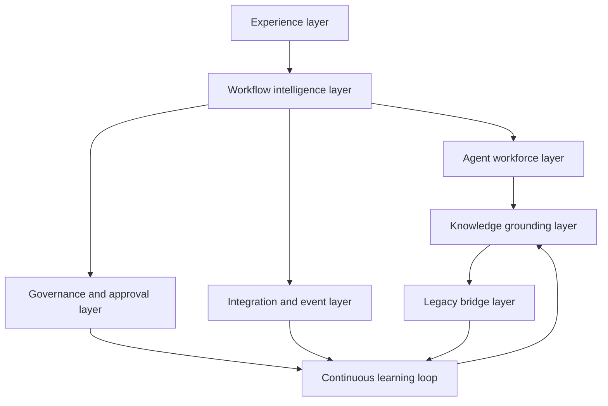

# Synapse Product Capability Map

- **Status**: draft product reframing
- **Purpose**: Map Synapse product capabilities separately from the
  orchestration tooling used to produce this repository's documentation.
- **Last updated**: 2026-05-03

## Capability layers

## Product capabilities

| Capability ID | Capability | Product purpose | MVP target | Current status |
| --- | --- | --- | --- | --- |
| CAP-001 | Workflow authoring experience | Let humans define repeatable expert workflows, initially through configuration and later through a visual designer. | MVP1 -> MVP3 | Partly specified through CLI-assisted workflow docs. |
| CAP-002 | Task packet generation | Convert workflow definitions into bounded coworker tasks with sources, deliverables, quality gates, and handoffs. | MVP1 | Specified as framework-domain contract. |
| CAP-003 | Canonical knowledge registry | Track approved sources, confidence, freshness, provenance, and applicability. | MVP2 | Started in source grounding docs. |
| CAP-004 | SME/persona template system | Package principal-level expertise into reusable role guidance and persona templates. | MVP2 | Needs dedicated persona iteration. |
| CAP-005 | Human approval and governance | Pause, route, approve, reject, or escalate high-impact work with evidence and audit trail. | MVP3 | Conceptual only. |
| CAP-006 | Live workflow monitoring | Show workflow, task, agent, validation, approval, and handoff status to human operators. | MVP3 | Conceptual only. |
| CAP-007 | Feedback and learning promotion | Promote repeated lessons into knowledge, templates, validators, workflows, or backlog gates. | MVP3 | Standards drafted; product behavior not yet specified. |
| CAP-008 | Hybrid event and integration contracts | Coordinate workflow events, approvals, telemetry, and external systems. | MVP3 -> MVP4 | Standards drafted; implementation deferred. |
| CAP-009 | Legacy bridge workflows | Stabilize legacy operations while extracting current-state truth and future-state requirements. | MVP4 | Candidate use case only. |
| CAP-010 | Product packaging and administration | Support tenants, users, permissions, billing/packaging, deployment, support, and operations. | Future | Not yet specified. |

## Tooling capabilities not owned by Synapse MVPs

| Tool capability | Source | Relationship to Synapse |
| --- | --- | --- |
| Current slash-command CLI | `orchestration-framework/cli.py` | Used to generate and coordinate docs in this repo. May inform future Synapse APIs but is not the product API. |
| Current runtime memos/task cards | `.orchestration/runtime/` | Operational evidence for this repository's agent work. May inform future handoff model. |
| Current Cursor rules | `.cursor/rules/` | Development-time operating policy. May inform future governance/product UX but is not customer-facing UX. |
| Current workflow YAML | `.orchestration/config/workflows/` | Authoring format for this repo. May be one import/export format later. |

## Capability dependencies

1. CAP-001 and CAP-002 need clear canonical inputs and task-packet contracts.
2. CAP-003 must precede robust CAP-004 persona behavior.
3. CAP-005 and CAP-006 require workflow state, task status, and event contracts.
4. CAP-007 requires validation and review events plus accepted promotion targets.
5. CAP-009 should wait for a real legacy corpus and customer/domain validation.

## Open product questions

- Which initial buyer/user segment should Synapse serve first?
- Is Synapse initially an internal platform, SaaS product, open-core framework, or services-enabled product?
- Which product surface comes first after CLI-assisted MVP1: visual workflow designer, knowledge/persona registry, monitoring console, or approval console?
- What compliance, tenancy, retention, and access-control constraints apply?
